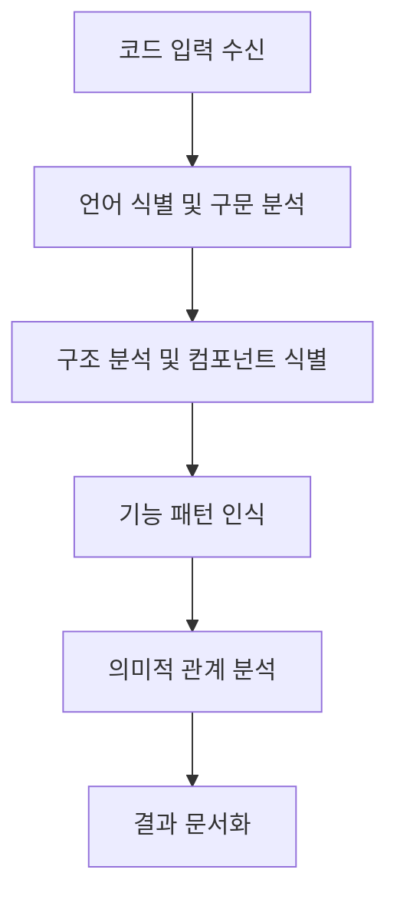

# Claude의 코드 분석 프로세스 설명 (Part 2)

## 7. 분석 데이터 처리 과정의 세부 단계

### 7.1 코드 처리 파이프라인

Claude가 코드 분석을 위해 사용하는 데이터 처리 과정은 다음과 같습니다:



1. **코드 입력 수신**: 첨부 파일에서 `src/components/FairyWindow.tsx` 코드를 읽습니다
2. **언어 식별 및 구문 분석**: TypeScript와 React JSX 문법을 인식하여 파싱합니다
3. **구조 분석 및 컴포넌트 식별**: 주요 컴포넌트와 함수, 상태 관리 로직을 식별합니다
4. **기능 패턴 인식**: 이벤트 처리, 상태 관리, 생명 주기 등의 패턴을 인식합니다
5. **의미적 관계 분석**: 컴포넌트 간의 관계와 데이터 흐름을 분석합니다
6. **결과 문서화**: 분석 결과를 구조화된 마크다운 형식으로 정리합니다

### 7.2 데이터 인식 프로세스

코드를 분석할 때 다음과 같은 패턴을 인식합니다:

1. **임포트 패턴**: 
   ```typescript
   import React, { useEffect, useState, useRef } from 'react';
   import { appWindow, PhysicalPosition, WebviewWindow } from '@tauri-apps/api/window';
   ```
   - React 컴포넌트 사용
   - Tauri API 활용
   - 상태 관리 및 라이프사이클 훅 사용

2. **컴포넌트 정의 패턴**:
   ```typescript
   const FairyWindow: React.FC = () => { ... }
   ```
   - 함수형 컴포넌트
   - TypeScript 타입 정의
   - React 구성 요소

3. **이벤트 리스너 패턴**:
   ```typescript
   const homeWindowFocusListener = listen('home-window-focused', async () => { ... })
   ```
   - 이벤트 기반 통신
   - 비동기 처리
   - 리소스 관리

## 8. 사용자 요청에 대한 응답 생성 과정

사용자가 "@FairyWindow.tsx 의 코드의 위치와 해당 내용을 분석해줘"라고 요청했을 때 응답 생성 과정은 다음과 같습니다:

### 8.1 응답 생성 단계

1. **요청 이해**: 코드 위치와 내용 분석이 필요하다고 판단
2. **도구 선택**: 
   - 파일 내용 확인을 위한 도구 선택
   - 코드 분석을 위한 내부 프로세싱
3. **분석 수행**: 
   - 코드 구조 파악
   - 주요 기능 식별
   - 패턴 인식
4. **응답 형식화**:
   - 마크다운 형식 적용
   - 코드 블록 포맷팅
   - 중요 정보 강조

### 8.2 정보 교환 과정

분석 과정에서 다음과 같은 정보 교환이 이루어집니다:

1. **입력 데이터**: 
   - 사용자 요청 텍스트
   - 첨부된 코드 파일 내용
   - 파일 위치 메타데이터

2. **내부 처리 데이터**:
   - 코드 구조 분석 정보
   - 컴포넌트 계층 구조
   - 기능적 패턴 정보
   - 관련 API 정보

3. **출력 데이터**:
   - 구조화된 분석 결과
   - 코드 샘플 및 설명
   - 파일 위치 정보
   - 주요 기능 요약

## 9. 결론: 통합 분석 프로세스

Claude의 코드 분석 프로세스는 다음과 같은 목표를 달성합니다:

1. **코드 구조의 명확한 이해**: 
   - FairyWindow.tsx 파일의 전체 구조 파악
   - 주요 컴포넌트 및 기능 식별
   - 코드 패턴 및 아키텍처 분석

2. **프로젝트 맥락에서의 해석**: 
   - DesktopFairy 프로젝트 내에서의 역할 이해
   - 다른 컴포넌트와의 상호작용 분석
   - 전체 아키텍처에서의 위치 파악

3. **사용자에게 유용한 정보 제공**: 
   - 파일 위치 및 구조에 대한 명확한 정보
   - 주요 기능 및 동작 방식 설명
   - 코드 샘플을 통한 이해 지원

이러한 분석 프로세스를 통해 사용자는 FairyWindow.tsx 파일의 구조와 기능을 효과적으로 이해할 수 있습니다. 