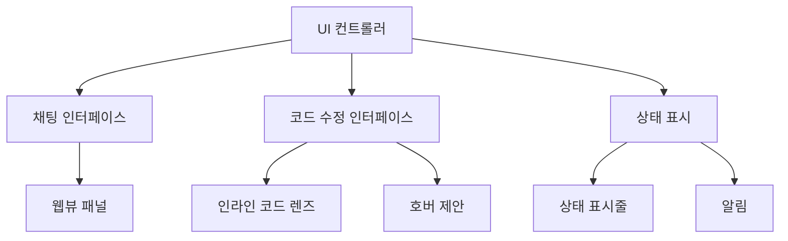

# VS Code AI 코딩 에이전트 구현 가이드 - 파트 2: 사용자 인터페이스

## 1. 사용자 인터페이스 개요

VS Code 플러그인의 사용자 인터페이스는 AI 코딩 에이전트의 사용 경험을 결정짓는 중요한 요소입니다. Cursor AI와 같은 효과적인 인터페이스를 구현하기 위해 VS Code의 다양한 UI 컴포넌트를 활용할 수 있습니다.

### 1.1 UI 아키텍처

AI 코딩 에이전트의 UI 아키텍처:



## 2. 채팅 인터페이스 구현

Cursor AI의 주요 특징 중 하나는 직관적인 채팅 인터페이스입니다. VS Code에서 이를 구현하는 방법을 살펴보겠습니다.

### 2.1 웹뷰 패널

웹뷰 패널은 HTML, CSS, JavaScript를 사용하여 풍부한 UI를 제공합니다:

```typescript
// ui/chatPanel.ts
import * as vscode from 'vscode';
import { AIModelConnector } from '../ai/modelConnector';
import { getNonce } from '../utils/security';

export class ChatPanel {
    public static currentPanel: ChatPanel | undefined;
    private readonly _panel: vscode.WebviewPanel;
    private readonly _context: vscode.ExtensionContext;
    private readonly _aiConnector: AIModelConnector;
    private _disposables: vscode.Disposable[] = [];

    private constructor(
        panel: vscode.WebviewPanel,
        context: vscode.ExtensionContext,
        aiConnector: AIModelConnector
    ) {
        this._panel = panel;
        this._context = context;
        this._aiConnector = aiConnector;

        // 웹뷰 내용 설정
        this._update();

        // 패널이 닫힐 때 정리
        this._panel.onDidDispose(() => this.dispose(), null, this._disposables);

        // 패널 상태가 변경될 때 업데이트
        this._panel.onDidChangeViewState(
            e => {
                if (this._panel.visible) {
                    this._update();
                }
            },
            null,
            this._disposables
        );

        // 웹뷰로부터 메시지 처리
        this._panel.webview.onDidReceiveMessage(
            async message => {
                switch (message.command) {
                    case 'sendQuery':
                        await this._handleUserQuery(message.text);
                        break;
                    case 'insertCode':
                        await this._insertCode(message.code);
                        break;
                }
            },
            null,
            this._disposables
        );
    }

    public static createOrShow(
        context: vscode.ExtensionContext,
        aiConnector: AIModelConnector
    ) {
        const column = vscode.window.activeTextEditor
            ? vscode.window.activeTextEditor.viewColumn
            : undefined;

        // 이미 패널이 있으면 재사용
        if (ChatPanel.currentPanel) {
            ChatPanel.currentPanel._panel.reveal(column);
            return;
        }

        // 새 패널 생성
        const panel = vscode.window.createWebviewPanel(
            'aiChatPanel',
            'AI 코딩 어시스턴트',
            column || vscode.ViewColumn.One,
            {
                enableScripts: true,
                retainContextWhenHidden: true,
                localResourceRoots: [
                    vscode.Uri.joinPath(context.extensionUri, 'media')
                ]
            }
        );

        ChatPanel.currentPanel = new ChatPanel(panel, context, aiConnector);
    }

    private async _handleUserQuery(query: string) {
        // 사용자 메시지를 UI에 추가
        this._postMessageToWebview({
            command: 'addMessage',
            message: {
                role: 'user',
                content: query
            }
        });

        try {
            // "AI가 생각 중" 표시
            this._postMessageToWebview({
                command: 'showThinking',
                value: true
            });

            // AI 응답 생성
            const response = await this._aiConnector.generateCompletion(query);

            // "AI가 생각 중" 표시 제거
            this._postMessageToWebview({
                command: 'showThinking',
                value: false
            });

            // AI 응답을 UI에 추가
            this._postMessageToWebview({
                command: 'addMessage',
                message: {
                    role: 'assistant',
                    content: response
                }
            });
        } catch (error) {
            console.error('AI 응답 생성 중 오류:', error);
            
            // 오류 메시지 표시
            this._postMessageToWebview({
                command: 'showThinking',
                value: false
            });
            
            this._postMessageToWebview({
                command: 'showError',
                message: '응답 생성 중 오류가 발생했습니다. 다시 시도해주세요.'
            });
        }
    }

    private async _insertCode(code: string) {
        const editor = vscode.window.activeTextEditor;
        if (!editor) {
            vscode.window.showErrorMessage('활성화된 편집기가 없습니다.');
            return;
        }

        editor.edit(editBuilder => {
            editBuilder.insert(editor.selection.active, code);
        });
    }

    private _update() {
        const webview = this._panel.webview;
        this._panel.title = "AI 코딩 어시스턴트";
        this._panel.webview.html = this._getHtmlForWebview(webview);
    }

    private _getHtmlForWebview(webview: vscode.Webview) {
        // 보안을 위한 nonce 생성
        const nonce = getNonce();

        // 로컬 리소스 로드
        const scriptUri = webview.asWebviewUri(
            vscode.Uri.joinPath(this._context.extensionUri, 'media', 'chat.js')
        );
        const styleUri = webview.asWebviewUri(
            vscode.Uri.joinPath(this._context.extensionUri, 'media', 'chat.css')
        );

        return `<!DOCTYPE html>
        <html lang="ko">
        <head>
            <meta charset="UTF-8">
            <meta name="viewport" content="width=device-width, initial-scale=1.0">
            <meta http-equiv="Content-Security-Policy" content="default-src 'none'; script-src 'nonce-${nonce}'; style-src ${webview.cspSource};">
            <link href="${styleUri}" rel="stylesheet">
            <title>AI 코딩 어시스턴트</title>
        </head>
        <body>
            <div id="chat-container">
                <div id="messages-container"></div>
                <div id="thinking-indicator" style="display: none;">AI가 생각 중...</div>
                <div id="input-container">
                    <textarea id="user-input" placeholder="질문이나 요청을 입력하세요..."></textarea>
                    <button id="send-button">전송</button>
                </div>
            </div>
            <script nonce="${nonce}" src="${scriptUri}"></script>
        </body>
        </html>`;
    }

    private _postMessageToWebview(message: any) {
        if (this._panel && this._panel.webview) {
            this._panel.webview.postMessage(message);
        }
    }

    public dispose() {
        ChatPanel.currentPanel = undefined;

        this._panel.dispose();

        while (this._disposables.length) {
            const disposable = this._disposables.pop();
            if (disposable) {
                disposable.dispose();
            }
        }
    }
}
```

### 2.2 프론트엔드 JavaScript 코드

웹뷰를 위한 프론트엔드 코드(`media/chat.js`):

```javascript
// chat.js
(function() {
    const vscode = acquireVsCodeApi();
    const messagesContainer = document.getElementById('messages-container');
    const userInput = document.getElementById('user-input');
    const sendButton = document.getElementById('send-button');
    const thinkingIndicator = document.getElementById('thinking-indicator');
    
    // 이전 상태 복원
    const previousState = vscode.getState() || { messages: [] };
    updateMessagesUI(previousState.messages);
    
    // 전송 버튼 클릭 이벤트
    sendButton.addEventListener('click', sendMessage);
    
    // 엔터 키 누르면 메시지 전송
    userInput.addEventListener('keydown', event => {
        if (event.key === 'Enter' && !event.shiftKey) {
            event.preventDefault();
            sendMessage();
        }
    });
    
    // VS Code에서 메시지 수신
    window.addEventListener('message', event => {
        const message = event.data;
        
        switch (message.command) {
            case 'addMessage':
                addMessage(message.message);
                break;
            case 'showThinking':
                thinkingIndicator.style.display = message.value ? 'block' : 'none';
                break;
            case 'showError':
                showError(message.message);
                break;
        }
    });
    
    function sendMessage() {
        const text = userInput.value.trim();
        if (!text) return;
        
        // VS Code로 메시지 전송
        vscode.postMessage({
            command: 'sendQuery',
            text: text
        });
        
        // 입력 필드 초기화
        userInput.value = '';
    }
    
    function addMessage(message) {
        // 메시지 목록 업데이트
        const currentState = vscode.getState() || { messages: [] };
        const messages = [...currentState.messages, message];
        vscode.setState({ messages });
        
        // UI 업데이트
        updateMessagesUI(messages);
    }
    
    function updateMessagesUI(messages) {
        messagesContainer.innerHTML = '';
        
        messages.forEach(message => {
            const messageElement = document.createElement('div');
            messageElement.classList.add('message', message.role);
            
            // 마크다운 렌더링을 위한 처리
            if (message.role === 'assistant') {
                messageElement.innerHTML = renderMarkdown(message.content);
                
                // 코드 블록에 "삽입" 버튼 추가
                const codeBlocks = messageElement.querySelectorAll('pre code');
                codeBlocks.forEach((codeBlock, index) => {
                    const insertButton = document.createElement('button');
                    insertButton.textContent = '코드 삽입';
                    insertButton.classList.add('insert-code-button');
                    insertButton.addEventListener('click', () => {
                        vscode.postMessage({
                            command: 'insertCode',
                            code: codeBlock.textContent
                        });
                    });
                    
                    const buttonContainer = document.createElement('div');
                    buttonContainer.classList.add('code-actions');
                    buttonContainer.appendChild(insertButton);
                    
                    codeBlock.parentElement.insertBefore(buttonContainer, codeBlock);
                });
            } else {
                messageElement.textContent = message.content;
            }
            
            messagesContainer.appendChild(messageElement);
        });
        
        // 스크롤을 가장 아래로
        messagesContainer.scrollTop = messagesContainer.scrollHeight;
    }
    
    function showError(message) {
        const errorElement = document.createElement('div');
        errorElement.classList.add('error-message');
        errorElement.textContent = message;
        messagesContainer.appendChild(errorElement);
        messagesContainer.scrollTop = messagesContainer.scrollHeight;
    }
    
    // 간단한 마크다운 렌더링 함수
    function renderMarkdown(markdown) {
        // 코드 블록 처리
        markdown = markdown.replace(/```(\w*)\n([\s\S]*?)```/g, 
            '<pre><code class="language-$1">$2</code></pre>');
        
        // 인라인 코드 처리
        markdown = markdown.replace(/`([^`]+)`/g, '<code>$1</code>');
        
        // 제목 처리
        markdown = markdown.replace(/^### (.*$)/gm, '<h3>$1</h3>');
        markdown = markdown.replace(/^## (.*$)/gm, '<h2>$1</h2>');
        markdown = markdown.replace(/^# (.*$)/gm, '<h1>$1</h1>');
        
        // 목록 처리
        markdown = markdown.replace(/^\* (.*$)/gm, '<li>$1</li>');
        markdown = markdown.replace(/^- (.*$)/gm, '<li>$1</li>');
        
        // 굵은 텍스트
        markdown = markdown.replace(/\*\*(.*?)\*\*/g, '<strong>$1</strong>');
        
        // 기울임체
        markdown = markdown.replace(/\*(.*?)\*/g, '<em>$1</em>');
        
        return markdown;
    }
})();
```

### 2.3 스타일링

웹뷰 스타일링(`media/chat.css`):

```css
/* chat.css */
body {
    margin: 0;
    padding: 0;
    font-family: -apple-system, BlinkMacSystemFont, 'Segoe UI', Roboto, Oxygen, Ubuntu, Cantarell, 'Open Sans', 'Helvetica Neue', sans-serif;
    background-color: var(--vscode-editor-background);
    color: var(--vscode-editor-foreground);
}

#chat-container {
    display: flex;
    flex-direction: column;
    height: 100vh;
    max-width: 100%;
    margin: 0 auto;
}

#messages-container {
    flex: 1;
    overflow-y: auto;
    padding: 16px;
}

#thinking-indicator {
    padding: 10px;
    text-align: center;
    font-style: italic;
    color: var(--vscode-descriptionForeground);
}

#input-container {
    display: flex;
    padding: 16px;
    background-color: var(--vscode-editor-background);
    border-top: 1px solid var(--vscode-panel-border);
}

#user-input {
    flex: 1;
    min-height: 60px;
    padding: 8px;
    border: 1px solid var(--vscode-input-border);
    background-color: var(--vscode-input-background);
    color: var(--vscode-input-foreground);
    resize: vertical;
    font-family: inherit;
    border-radius: 4px;
}

#send-button {
    margin-left: 8px;
    padding: 0 16px;
    background-color: var(--vscode-button-background);
    color: var(--vscode-button-foreground);
    border: none;
    cursor: pointer;
    border-radius: 4px;
}

#send-button:hover {
    background-color: var(--vscode-button-hoverBackground);
}

.message {
    margin-bottom: 16px;
    padding: 12px;
    border-radius: 6px;
    max-width: 80%;
}

.user {
    align-self: flex-end;
    background-color: var(--vscode-button-background);
    color: var(--vscode-button-foreground);
    margin-left: auto;
}

.assistant {
    background-color: var(--vscode-editor-inactiveSelectionBackground);
    color: var(--vscode-editor-foreground);
}

.error-message {
    background-color: var(--vscode-inputValidation-errorBackground);
    color: var(--vscode-inputValidation-errorForeground);
    padding: 8px;
    margin-bottom: 16px;
    border-radius: 4px;
}

/* 코드 블록 스타일 */
pre {
    background-color: var(--vscode-textCodeBlock-background);
    padding: 10px;
    border-radius: 5px;
    overflow-x: auto;
    position: relative;
}

code {
    font-family: 'Courier New', Courier, monospace;
}

.code-actions {
    display: flex;
    justify-content: flex-end;
    padding: 5px 0;
}

.insert-code-button {
    background-color: var(--vscode-button-secondaryBackground);
    color: var(--vscode-button-secondaryForeground);
    border: none;
    padding: 4px 8px;
    border-radius: 2px;
    cursor: pointer;
    font-size: 12px;
}

.insert-code-button:hover {
    background-color: var(--vscode-button-secondaryHoverBackground);
}
```

## 3. 코드 렌즈 및 인라인 제안

Cursor AI의 또 다른 강력한 기능은 코드 렌즈와 인라인 제안입니다. 이를 구현하는 방법을 알아보겠습니다.

### 3.1 코드 렌즈 프로바이더

함수나 클래스 위에 AI 액션을 제공하는 코드 렌즈:

```typescript
// ui/codeLensProvider.ts
import * as vscode from 'vscode';
import { AIModelConnector } from '../ai/modelConnector';

export class AICodeLensProvider implements vscode.CodeLensProvider {
    private _aiConnector: AIModelConnector;
    private _onDidChangeCodeLenses: vscode.EventEmitter<void> = new vscode.EventEmitter<void>();
    public readonly onDidChangeCodeLenses: vscode.Event<void> = this._onDidChangeCodeLenses.event;

    constructor(aiConnector: AIModelConnector) {
        this._aiConnector = aiConnector;
    }

    public provideCodeLenses(
        document: vscode.TextDocument,
        token: vscode.CancellationToken
    ): vscode.ProviderResult<vscode.CodeLens[]> {
        const codeLenses: vscode.CodeLens[] = [];
        const text = document.getText();
        
        // 정규식을 사용하여 함수 및 클래스 선언 찾기
        const functionRegex = /function\s+(\w+)|class\s+(\w+)|const\s+(\w+)\s*=\s*(?:async\s*)?\(\)/g;
        let matches;
        
        while ((matches = functionRegex.exec(text)) !== null) {
            const functionName = matches[1] || matches[2] || matches[3];
            const position = document.positionAt(matches.index);
            const range = new vscode.Range(
                position,
                position.translate(0, matches[0].length)
            );
            
            // "설명 생성" 코드 렌즈
            codeLenses.push(
                new vscode.CodeLens(range, {
                    title: '📝 AI: 설명 생성',
                    command: 'aicodingagent.explainCode',
                    arguments: [document.uri, range]
                })
            );
            
            // "최적화 제안" 코드 렌즈
            codeLenses.push(
                new vscode.CodeLens(range, {
                    title: '🚀 AI: 최적화 제안',
                    command: 'aicodingagent.optimizeCode',
                    arguments: [document.uri, range]
                })
            );
        }
        
        return codeLenses;
    }
}
```

### 3.2 코드 액션 프로바이더

코드 액션을 통한 인라인 제안:

```typescript
// ui/codeActionProvider.ts
import * as vscode from 'vscode';
import { AIModelConnector } from '../ai/modelConnector';

export class AICodeActionProvider implements vscode.CodeActionProvider {
    private _aiConnector: AIModelConnector;

    constructor(aiConnector: AIModelConnector) {
        this._aiConnector = aiConnector;
    }

    public provideCodeActions(
        document: vscode.TextDocument,
        range: vscode.Range | vscode.Selection,
        context: vscode.CodeActionContext,
        token: vscode.CancellationToken
    ): vscode.ProviderResult<(vscode.Command | vscode.CodeAction)[]> {
        const actions: vscode.CodeAction[] = [];
        
        // 선택된 코드에 대한 액션
        if (!range.isEmpty) {
            // "선택 영역 설명" 액션
            const explainAction = new vscode.CodeAction(
                'AI: 이 코드 설명',
                vscode.CodeActionKind.RefactorRewrite
            );
            explainAction.command = {
                command: 'aicodingagent.explainCode',
                title: 'AI: 이 코드 설명',
                arguments: [document.uri, range]
            };
            actions.push(explainAction);
            
            // "선택 영역 개선" 액션
            const improveAction = new vscode.CodeAction(
                'AI: 이 코드 개선',
                vscode.CodeActionKind.RefactorRewrite
            );
            improveAction.command = {
                command: 'aicodingagent.improveCode',
                title: 'AI: 이 코드 개선',
                arguments: [document.uri, range]
            };
            actions.push(improveAction);
        }
        
        // 오류나 경고에 기반한 액션
        if (context.diagnostics.length > 0) {
            // "오류 해결 제안" 액션
            const fixAction = new vscode.CodeAction(
                'AI: 오류 해결 제안',
                vscode.CodeActionKind.QuickFix
            );
            fixAction.command = {
                command: 'aicodingagent.fixErrors',
                title: 'AI: 오류 해결 제안',
                arguments: [document.uri, context.diagnostics]
            };
            actions.push(fixAction);
        }
        
        return actions;
    }
}
```

### 3.3 호버 프로바이더

코드 위에 마우스를 올렸을 때 추가 정보를 제공하는 호버:

```typescript
// ui/hoverProvider.ts
import * as vscode from 'vscode';
import { AIModelConnector } from '../ai/modelConnector';

export class AIHoverProvider implements vscode.HoverProvider {
    private _aiConnector: AIModelConnector;
    private _cache: Map<string, {explanation: string, timestamp: number}> = new Map();
    private readonly _cacheDuration: number = 3600000; // 1시간 (밀리초)

    constructor(aiConnector: AIModelConnector) {
        this._aiConnector = aiConnector;
    }

    async provideHover(
        document: vscode.TextDocument,
        position: vscode.Position,
        token: vscode.CancellationToken
    ): Promise<vscode.Hover | null> {
        // 현재 위치의 단어 확인
        const wordRange = document.getWordRangeAtPosition(position);
        if (!wordRange) {
            return null;
        }
        
        const word = document.getText(wordRange);
        
        // 호버가 필요한 식별자인지 확인
        if (word.length < 3 || this._isCommonKeyword(word)) {
            return null;
        }
        
        // 캐시에서 설명 확인
        const cacheKey = `${document.fileName}:${word}`;
        const cached = this._cache.get(cacheKey);
        
        if (cached && (Date.now() - cached.timestamp) < this._cacheDuration) {
            return new vscode.Hover(cached.explanation);
        }
        
        // 주변 컨텍스트 수집
        const lineText = document.lineAt(position.line).text;
        const surroundingLines = this._getSurroundingLines(document, position.line, 3);
        
        // 생각 중 표시를 위한 마크다운
        const thinkingMarkdown = new vscode.MarkdownString('AI가 분석 중...');
        const hover = new vscode.Hover(thinkingMarkdown);
        
        // 비동기로 설명 생성
        this._generateExplanationAsync(word, lineText, surroundingLines, cacheKey)
            .catch(error => console.error('호버 설명 생성 중 오류:', error));
        
        return hover;
    }

    private _isCommonKeyword(word: string): boolean {
        const commonKeywords = [
            'if', 'else', 'for', 'while', 'do', 'switch', 'case',
            'break', 'continue', 'return', 'try', 'catch', 'finally',
            'var', 'let', 'const', 'function', 'class', 'import', 'export'
        ];
        return commonKeywords.includes(word);
    }

    private _getSurroundingLines(
        document: vscode.TextDocument,
        line: number,
        count: number
    ): string {
        const startLine = Math.max(0, line - count);
        const endLine = Math.min(document.lineCount - 1, line + count);
        
        let result = '';
        for (let i = startLine; i <= endLine; i++) {
            result += document.lineAt(i).text + '\n';
        }
        
        return result;
    }

    private async _generateExplanationAsync(
        word: string,
        lineText: string,
        surroundingCode: string,
        cacheKey: string
    ): Promise<void> {
        try {
            const prompt = `다음 코드에서 "${word}"에 대한 간단한 설명을 한두 문장으로 제공해주세요. 기술적으로 정확하고 간결해야 합니다.

주변 코드:
\`\`\`
${surroundingCode}
\`\`\`

현재 줄:
\`\`\`
${lineText}
\`\`\``;

            const explanation = await this._aiConnector.generateCompletion(
                prompt,
                { maxTokens: 100, temperature: 0.3 }
            );
            
            // 캐시에 저장
            this._cache.set(cacheKey, {
                explanation,
                timestamp: Date.now()
            });
            
            // 호버 내용 업데이트
            // 참고: VS Code는 현재 동적으로 호버 내용을 업데이트하는 API를 제공하지 않음
            // 사용자가 호버를 닫고 다시 열어야 새 내용이 표시됨
        } catch (error) {
            console.error('호버 설명 생성 중 오류:', error);
        }
    }
}
```

## 4. 명령 등록 및 확장 활성화

모든 UI 구성 요소를 등록하고 활성화하는 과정:

```typescript
// commands/registry.ts
import * as vscode from 'vscode';
import { AIModelConnector } from '../ai/modelConnector';
import { CodeContextProvider } from '../code/contextProvider';
import { ChatPanel } from '../ui/chatPanel';
import { AICodeLensProvider } from '../ui/codeLensProvider';
import { AICodeActionProvider } from '../ui/codeActionProvider';
import { AIHoverProvider } from '../ui/hoverProvider';

export class CommandRegistry {
    private _aiConnector: AIModelConnector;
    private _contextProvider: CodeContextProvider;
    private _uiProvider: any;

    constructor(
        aiConnector: AIModelConnector,
        contextProvider: CodeContextProvider,
        uiProvider: any
    ) {
        this._aiConnector = aiConnector;
        this._contextProvider = contextProvider;
        this._uiProvider = uiProvider;
    }

    public registerAll(context: vscode.ExtensionContext): void {
        // 채팅 패널 명령
        context.subscriptions.push(
            vscode.commands.registerCommand('aicodingagent.startChat', () => {
                ChatPanel.createOrShow(context, this._aiConnector);
            })
        );
        
        // 코드 이해 및 개선 명령
        context.subscriptions.push(
            vscode.commands.registerCommand(
                'aicodingagent.explainCode',
                async (uri: vscode.Uri, range: vscode.Range) => {
                    await this._explainCode(uri, range);
                }
            )
        );
        
        context.subscriptions.push(
            vscode.commands.registerCommand(
                'aicodingagent.improveCode',
                async (uri: vscode.Uri, range: vscode.Range) => {
                    await this._improveCode(uri, range);
                }
            )
        );
        
        context.subscriptions.push(
            vscode.commands.registerCommand(
                'aicodingagent.optimizeCode',
                async (uri: vscode.Uri, range: vscode.Range) => {
                    await this._optimizeCode(uri, range);
                }
            )
        );
        
        context.subscriptions.push(
            vscode.commands.registerCommand(
                'aicodingagent.fixErrors',
                async (uri: vscode.Uri, diagnostics: vscode.Diagnostic[]) => {
                    await this._fixErrors(uri, diagnostics);
                }
            )
        );
        
        // UI 프로바이더 등록
        this._registerProviders(context);
    }

    private _registerProviders(context: vscode.ExtensionContext): void {
        // 코드 렌즈 프로바이더
        context.subscriptions.push(
            vscode.languages.registerCodeLensProvider(
                { scheme: 'file', language: '*' },
                new AICodeLensProvider(this._aiConnector)
            )
        );
        
        // 코드 액션 프로바이더
        context.subscriptions.push(
            vscode.languages.registerCodeActionsProvider(
                { scheme: 'file', language: '*' },
                new AICodeActionProvider(this._aiConnector),
                { providedCodeActionKinds: [vscode.CodeActionKind.RefactorRewrite, vscode.CodeActionKind.QuickFix] }
            )
        );
        
        // 호버 프로바이더
        context.subscriptions.push(
            vscode.languages.registerHoverProvider(
                { scheme: 'file', language: '*' },
                new AIHoverProvider(this._aiConnector)
            )
        );
    }

    private async _explainCode(uri: vscode.Uri, range: vscode.Range): Promise<void> {
        try {
            const document = await vscode.workspace.openTextDocument(uri);
            const selectedCode = document.getText(range);
            
            // 채팅 패널이 없으면 생성
            ChatPanel.createOrShow(vscode.extensions.getExtension('aicodingagent')!.extensionContext, this._aiConnector);
            
            // 사용자 요청 및 응답 처리 로직
            // ...
        } catch (error) {
            vscode.window.showErrorMessage('코드 설명 생성 중 오류가 발생했습니다.');
            console.error(error);
        }
    }

    // 기타 명령 구현...
}
```

## 5. 다음 파트 소개

다음 파트에서는 AI 언어 모델 통합에 초점을 맞추어 설명합니다. 주요 내용은 다음과 같습니다:

- 다양한 AI 모델(Claude, GPT 등) 연결 방법
- 효과적인 프롬프트 엔지니어링 전략
- 컨텍스트 최적화 및 토큰 관리
- 응답 파싱 및 처리 