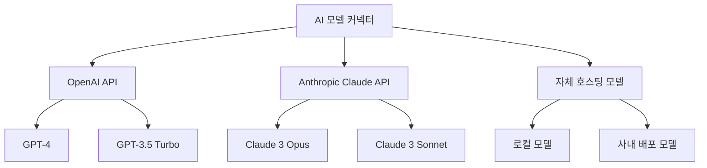

# VS Code AI 코딩 에이전트 구현 가이드 - 파트 3: AI 모델 통합

## 1. AI 모델 통합 개요

Cursor AI의 핵심 기능은 강력한 언어 모델을 코딩 환경에 효과적으로 통합하는 것입니다. 이 부분에서는 여러 AI 모델을 VS Code 플러그인에 통합하는 방법을 살펴보겠습니다.

### 1.1 지원 모델

AI 코딩 에이전트는 다양한 언어 모델을 지원할 수 있습니다:



## 2. 모델 커넥터 구현

다양한 AI 모델을 지원하는 유연한 커넥터 시스템을 구현해 보겠습니다.

### 2.1 기본 모델 인터페이스

```typescript
// ai/models/baseModel.ts
export interface CompletionOptions {
    maxTokens?: number;
    temperature?: number;
    topP?: number;
    frequencyPenalty?: number;
    presencePenalty?: number;
    stop?: string[];
}

export interface AIModel {
    generateCompletion(prompt: string, options?: CompletionOptions): Promise<string>;
    estimateTokens(text: string): number;
    getMaxContextTokens(): number;
}
```

### 2.2 OpenAI 모델 구현

```typescript
// ai/models/openaiModel.ts
import { OpenAI } from 'openai';
import { AIModel, CompletionOptions } from './baseModel';

export class OpenAIModel implements AIModel {
    private client: OpenAI;
    private model: string;
    private maxContextTokens: number;

    constructor(apiKey: string, model: string = 'gpt-4') {
        this.client = new OpenAI({
            apiKey: apiKey
        });
        this.model = model;
        
        // 모델별 최대 컨텍스트 크기 설정
        switch (model) {
            case 'gpt-4':
                this.maxContextTokens = 8192;
                break;
            case 'gpt-3.5-turbo':
                this.maxContextTokens = 4096;
                break;
            case 'gpt-4-turbo':
                this.maxContextTokens = 128000;
                break;
            default:
                this.maxContextTokens = 4096;
        }
    }

    async generateCompletion(prompt: string, options?: CompletionOptions): Promise<string> {
        try {
            const response = await this.client.chat.completions.create({
                model: this.model,
                messages: [{ role: 'user', content: prompt }],
                max_tokens: options?.maxTokens,
                temperature: options?.temperature,
                top_p: options?.topP,
                frequency_penalty: options?.frequencyPenalty,
                presence_penalty: options?.presencePenalty,
                stop: options?.stop
            });
            
            return response.choices[0].message.content || '';
        } catch (error) {
            console.error('OpenAI API 호출 중 오류:', error);
            throw new Error('AI 응답 생성 중 오류가 발생했습니다.');
        }
    }

    estimateTokens(text: string): number {
        // 간단한 토큰 추정 - 실제로는 더 정확한 토크나이저를 사용해야 함
        return Math.ceil(text.length / 4);
    }

    getMaxContextTokens(): number {
        return this.maxContextTokens;
    }
}
```

### 2.3 Claude 모델 구현

```typescript
// ai/models/claudeModel.ts
import { AIModel, CompletionOptions } from './baseModel';
import axios from 'axios';

export class ClaudeModel implements AIModel {
    private apiKey: string;
    private model: string;
    private maxContextTokens: number;

    constructor(apiKey: string, model: string = 'claude-3-opus-20240229') {
        this.apiKey = apiKey;
        this.model = model;
        
        // 모델별 최대 컨텍스트 크기 설정
        switch (model) {
            case 'claude-3-opus-20240229':
                this.maxContextTokens = 200000;
                break;
            case 'claude-3-sonnet-20240229':
                this.maxContextTokens = 180000;
                break;
            default:
                this.maxContextTokens = 100000;
        }
    }

    async generateCompletion(prompt: string, options?: CompletionOptions): Promise<string> {
        try {
            const response = await axios.post(
                'https://api.anthropic.com/v1/messages',
                {
                    model: this.model,
                    messages: [{ role: 'user', content: prompt }],
                    max_tokens: options?.maxTokens || 1000,
                    temperature: options?.temperature || 0.7,
                    top_p: options?.topP,
                    stop_sequences: options?.stop
                },
                {
                    headers: {
                        'x-api-key': this.apiKey,
                        'anthropic-version': '2023-06-01',
                        'content-type': 'application/json'
                    }
                }
            );
            
            return response.data.content[0].text;
        } catch (error) {
            console.error('Claude API 호출 중 오류:', error);
            throw new Error('AI 응답 생성 중 오류가 발생했습니다.');
        }
    }

    estimateTokens(text: string): number {
        // Claude의 토큰 추정 - 실제로는 더 정확한 토크나이저를 사용해야 함
        return Math.ceil(text.length / 3.5);
    }

    getMaxContextTokens(): number {
        return this.maxContextTokens;
    }
}
```

### 2.4 모델 팩토리

여러 모델 간의 전환을 용이하게 하는 팩토리 패턴:

```typescript
// ai/models/modelFactory.ts
import { AIModel } from './baseModel';
import { OpenAIModel } from './openaiModel';
import { ClaudeModel } from './claudeModel';

export type ModelType = 'gpt-4' | 'gpt-3.5-turbo' | 'claude-3-opus' | 'claude-3-sonnet';

export class ModelFactory {
    static createModel(type: ModelType, apiKey: string): AIModel {
        switch (type) {
            case 'gpt-4':
                return new OpenAIModel(apiKey, 'gpt-4');
            case 'gpt-3.5-turbo':
                return new OpenAIModel(apiKey, 'gpt-3.5-turbo');
            case 'claude-3-opus':
                return new ClaudeModel(apiKey, 'claude-3-opus-20240229');
            case 'claude-3-sonnet':
                return new ClaudeModel(apiKey, 'claude-3-sonnet-20240229');
            default:
                throw new Error(`지원하지 않는 모델 타입: ${type}`);
        }
    }
}
```

## 3. 프롬프트 엔지니어링

효과적인 AI 코딩 에이전트를 구현하려면 높은 품질의 프롬프트를 설계해야 합니다.

### 3.1 프롬프트 템플릿 시스템

```typescript
// ai/prompts/promptTemplates.ts
export interface TemplateVariables {
    [key: string]: string | number | boolean | any[];
}

export class PromptTemplate {
    private template: string;

    constructor(template: string) {
        this.template = template;
    }

    format(variables: TemplateVariables): string {
        let result = this.template;
        
        for (const [key, value] of Object.entries(variables)) {
            const placeholder = `{{${key}}}`;
            result = result.replace(new RegExp(placeholder, 'g'), String(value));
        }
        
        return result;
    }
}

// 코드 설명 프롬프트 템플릿
export const CODE_EXPLANATION_TEMPLATE = new PromptTemplate(`
당신은 코드 설명 전문가입니다. 다음 코드를 명확하고 간결하게 설명해주세요.

## 코드
\`\`\`{{language}}
{{code}}
\`\`\`

## 설명 요구사항
- 코드의 핵심 목적과 기능을 설명해주세요.
- 주요 알고리즘이나 디자인 패턴을 식별해주세요.
- 복잡하거나 중요한 부분을 강조해주세요.

설명은 마크다운 형식으로 제공해주세요.
`);

// 코드 최적화 프롬프트 템플릿
export const CODE_OPTIMIZATION_TEMPLATE = new PromptTemplate(`
당신은 코드 최적화 전문가입니다. 다음 코드를 분석하고 개선 방안을 제안해주세요.

## 코드
\`\`\`{{language}}
{{code}}
\`\`\`

## 최적화 요구사항
- 성능 향상을 위한 개선점을 제안해주세요.
- 가독성과 유지보수성을 높일 수 있는 방법을 제안해주세요.
- 잠재적인 버그나 오류를 식별해주세요.

개선된 코드 스니펫과 함께 설명을 제공해주세요.
`);

// 에러 수정 프롬프트 템플릿
export const ERROR_FIXING_TEMPLATE = new PromptTemplate(`
당신은 코드 디버깅 전문가입니다. 다음 코드에서 발생한 오류를 해결해주세요.

## 코드
\`\`\`{{language}}
{{code}}
\`\`\`

## 오류 메시지
{{errorMessage}}

## 해결 요구사항
- 오류의 원인을 정확히 식별해주세요.
- 문제를 해결하기 위한 코드 수정을 제안해주세요.
- 유사한 오류를 방지하기 위한 모범 사례를 제안해주세요.

수정된 코드와 함께 설명을 제공해주세요.
`);
```

### 3.2 컨텍스트 구성

효과적인 프롬프트를 생성하기 위한 컨텍스트 구성 시스템:

```typescript
// ai/prompts/contextBuilder.ts
import * as vscode from 'vscode';
import { CodeContextProvider } from '../../code/contextProvider';

export interface CodeContext {
    currentFileContent: string;
    language: string;
    cursorPosition: {
        line: number;
        character: number;
    };
    selectedCode: string;
    projectStructure: string;
    relatedFiles: string[];
    userQuery: string;
}

export class ContextBuilder {
    private contextProvider: CodeContextProvider;

    constructor(contextProvider: CodeContextProvider) {
        this.contextProvider = contextProvider;
    }

    async buildContext(query: string): Promise<CodeContext> {
        const editor = vscode.window.activeTextEditor;
        if (!editor) {
            throw new Error('활성화된 편집기가 없습니다.');
        }

        const document = editor.document;
        const selection = editor.selection;
        
        return {
            currentFileContent: document.getText(),
            language: document.languageId,
            cursorPosition: {
                line: selection.active.line,
                character: selection.active.character
            },
            selectedCode: document.getText(selection),
            projectStructure: await this.contextProvider.getProjectStructure(2),
            relatedFiles: await this.findRelatedFiles(document.fileName),
            userQuery: query
        };
    }

    private async findRelatedFiles(currentFile: string): Promise<string[]> {
        // 관련 파일을 찾는 로직
        // 현재 파일과 동일한 디렉토리의 파일 또는 참조된 파일 등을 반환
        return []; // 구현 필요
    }
}
```

### 3.3 프롬프트 최적화

프롬프트 최적화를 위한 유틸리티 기능:

```typescript
// ai/prompts/promptOptimizer.ts
import { AIModel } from '../models/baseModel';

export class PromptOptimizer {
    private model: AIModel;

    constructor(model: AIModel) {
        this.model = model;
    }

    optimizePrompt(prompt: string, maxTokens: number): string {
        const estimatedTokens = this.model.estimateTokens(prompt);
        
        if (estimatedTokens <= maxTokens) {
            return prompt;
        }
        
        // 프롬프트가 너무 길면 최적화
        return this.truncatePrompt(prompt, maxTokens);
    }

    private truncatePrompt(prompt: string, maxTokens: number): string {
        // 단순 문자열 길이 기반 최적화 (실제로는 더 정교한 방법 필요)
        const ratio = maxTokens / this.model.estimateTokens(prompt);
        
        // 코드 블록 보존 로직
        const codeBlocks = this.extractCodeBlocks(prompt);
        let textContent = this.removeCodeBlocks(prompt);
        
        // 텍스트 내용 줄이기
        textContent = this.truncateText(textContent, Math.floor(maxTokens * 0.4));
        
        // 코드 블록 선택적 포함
        return this.reconstructPrompt(textContent, codeBlocks, maxTokens);
    }

    private extractCodeBlocks(text: string): string[] {
        const regex = /```(?:\w+)?\n([\s\S]*?)```/g;
        const blocks: string[] = [];
        let match;
        
        while ((match = regex.exec(text)) !== null) {
            blocks.push(match[0]);
        }
        
        return blocks;
    }

    private removeCodeBlocks(text: string): string {
        return text.replace(/```(?:\w+)?\n[\s\S]*?```/g, '[CODE_BLOCK]');
    }

    private truncateText(text: string, targetLength: number): string {
        if (text.length <= targetLength) {
            return text;
        }
        
        // 문단 단위로 잘라내기
        const paragraphs = text.split('\n\n');
        let result = '';
        
        // 첫 번째와 마지막 문단은 항상 유지
        result += paragraphs[0] + '\n\n';
        
        // 중간 부분 선택적 포함
        const middleParagraphs = paragraphs.slice(1, -1);
        for (const para of middleParagraphs) {
            if (result.length + para.length + 4 <= targetLength) {
                result += para + '\n\n';
            }
        }
        
        // 마지막 문단 추가
        if (paragraphs.length > 1) {
            result += paragraphs[paragraphs.length - 1];
        }
        
        return result;
    }

    private reconstructPrompt(text: string, codeBlocks: string[], maxTokens: number): string {
        let result = text;
        
        // 남은 토큰 계산
        let remainingTokens = maxTokens - this.model.estimateTokens(result);
        
        // 코드 블록 선택적 추가
        for (const block of codeBlocks) {
            const blockTokens = this.model.estimateTokens(block);
            
            if (blockTokens <= remainingTokens) {
                // [CODE_BLOCK] 한 개만 교체
                result = result.replace('[CODE_BLOCK]', block);
                remainingTokens -= blockTokens;
            }
            
            if (result.indexOf('[CODE_BLOCK]') === -1) {
                break;
            }
        }
        
        // 남은 [CODE_BLOCK] 제거
        result = result.replace(/\[CODE_BLOCK\]/g, '*코드 분량이 너무 커서 생략됨*');
        
        return result;
    }
}
```

## 4. 메인 AI 커넥터

이제 모든 구성 요소를 통합하는 메인 AI 커넥터를 구현해 보겠습니다:

```typescript
// ai/modelConnector.ts
import * as vscode from 'vscode';
import { AIModel } from './models/baseModel';
import { ModelFactory, ModelType } from './models/modelFactory';
import { PromptTemplate } from './prompts/promptTemplates';
import { ContextBuilder } from './prompts/contextBuilder';
import { PromptOptimizer } from './prompts/promptOptimizer';
import { CodeContextProvider } from '../code/contextProvider';

export class AIModelConnector {
    private model: AIModel;
    private contextBuilder: ContextBuilder;
    private promptOptimizer: PromptOptimizer;
    private isProcessing: boolean = false;

    constructor() {
        const config = vscode.workspace.getConfiguration('aiCodingAgent');
        const apiKey = config.get<string>('apiKey') || '';
        const modelType = config.get<string>('modelType') as ModelType || 'gpt-4';
        
        this.model = ModelFactory.createModel(modelType, apiKey);
        this.contextBuilder = new ContextBuilder(new CodeContextProvider());
        this.promptOptimizer = new PromptOptimizer(this.model);
    }

    async generateCompletion(
        promptOrTemplate: string | PromptTemplate,
        variablesOrOptions?: any
    ): Promise<string> {
        if (this.isProcessing) {
            throw new Error('이미 다른 요청을 처리 중입니다.');
        }
        
        try {
            this.isProcessing = true;
            
            let prompt: string;
            let options: any = {};
            
            if (typeof promptOrTemplate === 'string' && typeof variablesOrOptions === 'object') {
                // 직접 프롬프트와 옵션
                prompt = promptOrTemplate;
                options = variablesOrOptions;
            } else if (promptOrTemplate instanceof PromptTemplate && typeof variablesOrOptions === 'object') {
                // 템플릿과 변수
                prompt = promptOrTemplate.format(variablesOrOptions);
            } else {
                // 사용자 쿼리를 컨텍스트와 결합
                const context = await this.contextBuilder.buildContext(promptOrTemplate as string);
                prompt = this.buildFullPrompt(context);
            }
            
            // 토큰 제한에 맞게 프롬프트 최적화
            const maxContextTokens = this.model.getMaxContextTokens();
            const maxPromptTokens = Math.floor(maxContextTokens * 0.7); // 응답을 위한 공간 확보
            prompt = this.promptOptimizer.optimizePrompt(prompt, maxPromptTokens);
            
            // AI 모델에 요청
            return await this.model.generateCompletion(prompt, options);
        } finally {
            this.isProcessing = false;
        }
    }

    private buildFullPrompt(context: any): string {
        return `
당신은 VS Code에서 동작하는 AI 코딩 어시스턴트입니다.
다음 코드와 컨텍스트를 기반으로 사용자 질문에 답하거나 코드를 생성해주세요.

## 현재 파일
\`\`\`${context.language}
${context.currentFileContent}
\`\`\`

## 커서 위치
${context.cursorPosition.line}:${context.cursorPosition.character}

## 선택된 코드
\`\`\`${context.language}
${context.selectedCode || '선택된 코드 없음'}
\`\`\`

## 프로젝트 구조
${context.projectStructure}

## 사용자 요청
${context.userQuery}

답변은 마크다운 형식으로 제공해주세요. 코드 스니펫이 포함된 경우 적절한 언어 구문 강조를 사용하세요.
`;
    }
}
```

## 5. 응답 처리 및 파싱

AI 모델로부터 받은 응답을 처리하고 파싱하는 시스템:

```typescript
// ai/responseParser.ts
export interface ParsedResponse {
    explanation?: string;
    codeBlocks: Array<{
        language: string;
        code: string;
    }>;
    recommendations?: string[];
}

export class ResponseParser {
    parse(response: string): ParsedResponse {
        return {
            explanation: this.extractExplanation(response),
            codeBlocks: this.extractCodeBlocks(response),
            recommendations: this.extractRecommendations(response)
        };
    }

    private extractExplanation(response: string): string {
        // 코드 블록을 제외한 텍스트를 설명으로 간주
        return response.replace(/```[\s\S]*?```/g, '[CODE]')
                      .replace(/\[CODE\]/g, '')
                      .trim();
    }

    extractCodeBlocks(response: string): Array<{language: string, code: string}> {
        const regex = /```([\w-]*)\n([\s\S]*?)```/g;
        const matches = [];
        let match;
        
        while ((match = regex.exec(response)) !== null) {
            matches.push({
                language: match[1] || 'text',
                code: match[2].trim()
            });
        }
        
        return matches;
    }

    private extractRecommendations(response: string): string[] {
        // 추천 항목 추출 (예: 목록 형태)
        const recommendations: string[] = [];
        const regex = /[-*] (.*)/g;
        let match;
        
        while ((match = regex.exec(response)) !== null) {
            recommendations.push(match[1].trim());
        }
        
        return recommendations;
    }
}
```

## 6. 다음 파트 소개

다음 파트에서는 개발자 경험 향상을 위한 고급 기능 구현에 초점을 맞춥니다. 주요 내용은 다음과 같습니다:

- 코드 자동 완성 기능 구현
- 테스트 자동 생성 기능
- 리팩토링 및 설명 생성 기능
- 오류 해결 및 디버깅 도우미 