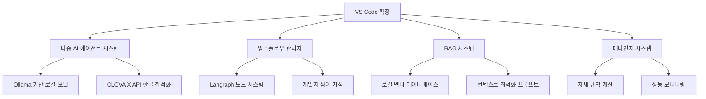

# VS Code AI 오케스트레이션 시스템: 개요

이 문서는 VS Code AI 오케스트레이션 시스템의 핵심 개념과 특징을 요약합니다. 자세한 내용은 각 세부 문서를 참조하세요.

## 핵심 개념

### 사람-AI 협업 개발 플랫폼

VS Code AI 오케스트레이션 시스템은 개발자와 여러 AI 에이전트가 팀으로 함께 일하는 개발 환경을 제공합니다. 다음과 같은 특징이 있습니다:

1. **개발자는 오케스트레이터 + 검토자**: 개발자는 AI 에이전트들의 작업 흐름을 정의하고 조정하는 동시에, 중요한 의사결정 지점에서 결과를 검토하고 논의합니다.

2. **다중 AI 에이전트**: 각각 다른 역할과 전문성을 가진 AI 에이전트들이 협업하여 복잡한 개발 작업을 수행합니다.

3. **Langraph 기반 유연한 워크플로우**: 노드 기반 시스템을 통해 개발 프로세스를 유연하게 정의하고 조정할 수 있습니다.

4. **조직 차원의 협업**: 여러 개발자와 AI 에이전트가 함께 작업할 수 있는 팀 기반 시스템을 지원합니다.

## 주요 기술 구성 요소

### 주요 기능

- **클라우드 기반 AI 지원**: OpenAI와 Claude API를 통한 강력한 AI 코딩 지원
- **한글 최적화**: CLOVA X API 활용한 한국어 개발 환경 최적화
- **RAG 시스템**: 코드베이스 기반 컨텍스트 인식 기능
- **메타인지 능력**: AI가 스스로 규칙을 개선하고 성능을 모니터링
- **유연한 워크플로우**: 개발 상황에 맞게 동적으로 조정 가능한 프로세스

## 주요 문서 목록

- [Part 1: 시스템 개요 및 아키텍처](vscode_ai_orchestration_part1.md)
- [Part 2: CLOVA X 통합 및 메타인지 기능](vscode_ai_orchestration_part2.md)
- [Part 3: RAG 시스템 및 워크플로우 예시](vscode_ai_orchestration_part3.md)

## 구현 로드맵

1. **기본 VS Code 확장 구조 구현**
2. **AI 모델 통합 및 다중 에이전트 시스템 구현**
3. **Langraph 기반 워크플로우 시스템 구현**
4. **CLOVA X API 통합**
5. **메타인지 시스템 구현**
6. **RAG 시스템 구현**
7. **팀 협업 기능 구현**

이 시스템은 인공지능과 인간 개발자가 각자의 강점을 활용하여 함께 일하는 새로운 개발 패러다임을 제시합니다. 개발자는 창의적인 의사결정과 방향 설정에 집중하고, AI는 반복적인 작업과 코드 생성을 담당하여 개발 생산성을 극대화합니다. 