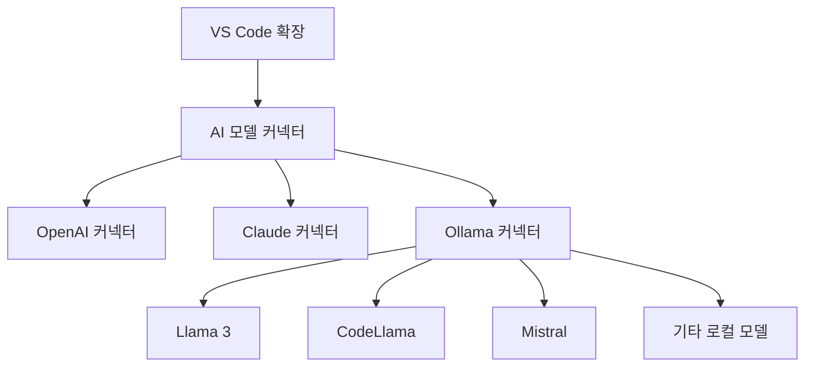

# VS Code AI 코딩 에이전트 확장 기능 - 다중 Ollama 지원

## 1. 개요

Ollama는 로컬 환경에서 다양한 오픈소스 AI 모델을 실행할 수 있게 해주는 도구입니다. VS Code AI 코딩 에이전트에 다중 Ollama 지원을 추가하면 다음과 같은 이점이 있습니다:

- 100% 로컬 개발 환경 구축 가능
- 민감한 코드 데이터를 외부 서버로 전송하지 않음
- 다양한 AI 모델을 상황에 맞게 전환하여 사용
- 인터넷 연결 없이도 AI 코딩 지원 가능



## 2. 구현 방법

### 2.1 Ollama 모델 커넥터 구현

```typescript
// ai/models/ollamaModel.ts
import { AIModel, CompletionOptions } from './baseModel';
import axios from 'axios';

export interface OllamaModelConfig {
    endpoint: string;
    modelName: string;
    contextSize: number;
}

export class OllamaModel implements AIModel {
    private endpoint: string;
    private modelName: string;
    private maxContextTokens: number;

    constructor(config: OllamaModelConfig) {
        this.endpoint = config.endpoint || 'http://localhost:11434';
        this.modelName = config.modelName;
        this.maxContextTokens = config.contextSize || 8192;
    }

    async generateCompletion(prompt: string, options?: CompletionOptions): Promise<string> {
        try {
            const response = await axios.post(`${this.endpoint}/api/generate`, {
                model: this.modelName,
                prompt: prompt,
                options: {
                    temperature: options?.temperature || 0.7,
                    top_p: options?.topP || 0.9,
                    max_tokens: options?.maxTokens || 1000,
                    stop: options?.stop || []
                },
                stream: false
            });
            
            return response.data.response;
        } catch (error) {
            console.error('Ollama API 호출 중 오류:', error);
            throw new Error('로컬 AI 모델 응답 생성 중 오류가 발생했습니다.');
        }
    }

    async generateCompletionStream(prompt: string, options?: CompletionOptions): Promise<ReadableStream<string>> {
        try {
            const response = await axios.post(
                `${this.endpoint}/api/generate`,
                {
                    model: this.modelName,
                    prompt: prompt,
                    options: {
                        temperature: options?.temperature || 0.7,
                        top_p: options?.topP || 0.9,
                        max_tokens: options?.maxTokens || 1000,
                        stop: options?.stop || []
                    },
                    stream: true
                },
                { responseType: 'stream' }
            );
            
            return response.data;
        } catch (error) {
            console.error('Ollama 스트리밍 API 호출 중 오류:', error);
            throw new Error('로컬 AI 모델 스트리밍 응답 생성 중 오류가 발생했습니다.');
        }
    }

    estimateTokens(text: string): number {
        // 간단한 토큰 추정 - 실제로는 모델별 토크나이저를 사용해야 함
        return Math.ceil(text.length / 3.5);
    }

    getMaxContextTokens(): number {
        return this.maxContextTokens;
    }
}
```

### 2.2 Ollama 모델 관리자 구현

여러 Ollama 모델을 관리하고 전환할 수 있는 관리자 클래스:

```typescript
// ai/models/ollamaManager.ts
import * as vscode from 'vscode';
import { OllamaModel, OllamaModelConfig } from './ollamaModel';
import axios from 'axios';

export class OllamaManager {
    private models: Map<string, OllamaModel> = new Map();
    private activeModelName: string | null = null;
    private endpoint: string;
    
    constructor(endpoint: string = 'http://localhost:11434') {
        this.endpoint = endpoint;
    }
    
    async initialize(): Promise<void> {
        try {
            await this.refreshAvailableModels();
            
            // 설정에서 기본 모델 로드
            const config = vscode.workspace.getConfiguration('aiCodingAgent.ollama');
            const defaultModel = config.get<string>('defaultModel');
            
            if (defaultModel && this.models.has(defaultModel)) {
                this.activeModelName = defaultModel;
            } else if (this.models.size > 0) {
                // 첫 번째 사용 가능한 모델을 기본값으로 설정
                this.activeModelName = Array.from(this.models.keys())[0];
            }
            
            // 상태 표시줄 업데이트
            this.updateStatusBar();
        } catch (error) {
            console.error('Ollama 초기화 중 오류:', error);
            vscode.window.showErrorMessage('Ollama 서버에 연결할 수 없습니다. Ollama가 실행 중인지 확인하세요.');
        }
    }
    
    async refreshAvailableModels(): Promise<void> {
        try {
            const response = await axios.get(`${this.endpoint}/api/tags`);
            const modelList = response.data.models || [];
            
            // 기존 모델 목록 초기화
            this.models.clear();
            
            // 새 모델 목록 추가
            for (const model of modelList) {
                const config: OllamaModelConfig = {
                    endpoint: this.endpoint,
                    modelName: model.name,
                    contextSize: this.getContextSizeForModel(model.name)
                };
                
                this.models.set(model.name, new OllamaModel(config));
            }
        } catch (error) {
            console.error('Ollama 모델 목록 가져오기 오류:', error);
            throw new Error('사용 가능한 Ollama 모델을 가져올 수 없습니다.');
        }
    }
    
    private getContextSizeForModel(modelName: string): number {
        // 모델별 컨텍스트 크기 설정
        if (modelName.includes('llama3:70b')) return 8192;
        if (modelName.includes('llama3')) return 8192;
        if (modelName.includes('codellama')) return 16384;
        if (modelName.includes('mistral')) return 8192;
        if (modelName.includes('mixtral')) return 32768;
        
        // 기본값
        return 4096;
    }
    
    getActiveModel(): OllamaModel | null {
        if (!this.activeModelName) return null;
        return this.models.get(this.activeModelName) || null;
    }
    
    async switchModel(modelName: string): Promise<void> {
        if (!this.models.has(modelName)) {
            throw new Error(`모델 '${modelName}'을(를) 찾을 수 없습니다.`);
        }
        
        this.activeModelName = modelName;
        
        // 설정 업데이트
        const config = vscode.workspace.getConfiguration('aiCodingAgent.ollama');
        await config.update('defaultModel', modelName, vscode.ConfigurationTarget.Global);
        
        // 상태 표시줄 업데이트
        this.updateStatusBar();
        
        vscode.window.showInformationMessage(`Ollama 모델을 '${modelName}'(으)로 전환했습니다.`);
    }
    
    getAvailableModels(): string[] {
        return Array.from(this.models.keys());
    }
    
    private updateStatusBar(): void {
        // 상태 표시줄 업데이트 로직 (상태 표시줄 구현이 필요함)
    }
}
```

### 2.3 다중 Ollama 서버 지원

여러 Ollama 서버를 지원하기 위한 설정 및 관리 기능:

```typescript
// ai/models/ollamaServerManager.ts
import * as vscode from 'vscode';
import { OllamaManager } from './ollamaManager';

export interface OllamaServerConfig {
    name: string;
    url: string;
    isActive: boolean;
}

export class OllamaServerManager {
    private servers: Map<string, OllamaManager> = new Map();
    private activeServerName: string | null = null;
    
    constructor() {}
    
    async initialize(): Promise<void> {
        // 설정에서 서버 구성 로드
        const config = vscode.workspace.getConfiguration('aiCodingAgent.ollama');
        const serverConfigs = config.get<OllamaServerConfig[]>('servers') || [];
        
        if (serverConfigs.length === 0) {
            // 기본 로컬 서버 추가
            serverConfigs.push({
                name: 'Local',
                url: 'http://localhost:11434',
                isActive: true
            });
            
            await config.update('servers', serverConfigs, vscode.ConfigurationTarget.Global);
        }
        
        // 각 서버에 대한 OllamaManager 생성
        for (const serverConfig of serverConfigs) {
            const manager = new OllamaManager(serverConfig.url);
            this.servers.set(serverConfig.name, manager);
            
            // 활성 서버 설정
            if (serverConfig.isActive) {
                this.activeServerName = serverConfig.name;
            }
        }
        
        // 활성 서버가 없으면 첫 번째 서버를 활성화
        if (!this.activeServerName && this.servers.size > 0) {
            this.activeServerName = Array.from(this.servers.keys())[0];
        }
        
        // 활성 서버 초기화
        if (this.activeServerName) {
            const activeManager = this.servers.get(this.activeServerName);
            if (activeManager) {
                try {
                    await activeManager.initialize();
                } catch (error) {
                    console.error(`서버 '${this.activeServerName}' 초기화 오류:`, error);
                }
            }
        }
    }
    
    getActiveManager(): OllamaManager | null {
        if (!this.activeServerName) return null;
        return this.servers.get(this.activeServerName) || null;
    }
    
    async switchServer(serverName: string): Promise<void> {
        if (!this.servers.has(serverName)) {
            throw new Error(`서버 '${serverName}'을(를) 찾을 수 없습니다.`);
        }
        
        this.activeServerName = serverName;
        
        // 설정 업데이트
        const config = vscode.workspace.getConfiguration('aiCodingAgent.ollama');
        const serverConfigs = config.get<OllamaServerConfig[]>('servers') || [];
        
        for (const serverConfig of serverConfigs) {
            serverConfig.isActive = serverConfig.name === serverName;
        }
        
        await config.update('servers', serverConfigs, vscode.ConfigurationTarget.Global);
        
        // 새로 활성화된 서버 초기화
        const activeManager = this.servers.get(this.activeServerName);
        if (activeManager) {
            try {
                await activeManager.initialize();
                vscode.window.showInformationMessage(`Ollama 서버를 '${serverName}'(으)로 전환했습니다.`);
            } catch (error) {
                console.error(`서버 '${serverName}' 초기화 오류:`, error);
                vscode.window.showErrorMessage(`'${serverName}' 서버에 연결할 수 없습니다.`);
            }
        }
    }
    
    getAvailableServers(): string[] {
        return Array.from(this.servers.keys());
    }
    
    async addServer(name: string, url: string): Promise<void> {
        if (this.servers.has(name)) {
            throw new Error(`'${name}' 서버가 이미 존재합니다.`);
        }
        
        // 새 서버 추가
        const manager = new OllamaManager(url);
        this.servers.set(name, manager);
        
        // 설정 업데이트
        const config = vscode.workspace.getConfiguration('aiCodingAgent.ollama');
        const serverConfigs = config.get<OllamaServerConfig[]>('servers') || [];
        
        serverConfigs.push({
            name,
            url,
            isActive: false
        });
        
        await config.update('servers', serverConfigs, vscode.ConfigurationTarget.Global);
        vscode.window.showInformationMessage(`Ollama 서버 '${name}'이(가) 추가되었습니다.`);
    }
    
    async removeServer(name: string): Promise<void> {
        if (!this.servers.has(name)) {
            throw new Error(`서버 '${name}'을(를) 찾을 수 없습니다.`);
        }
        
        // 현재 활성 서버인 경우 다른 서버로 전환
        if (this.activeServerName === name) {
            const availableServers = this.getAvailableServers().filter(s => s !== name);
            if (availableServers.length > 0) {
                await this.switchServer(availableServers[0]);
            } else {
                this.activeServerName = null;
            }
        }
        
        // 서버 제거
        this.servers.delete(name);
        
        // 설정 업데이트
        const config = vscode.workspace.getConfiguration('aiCodingAgent.ollama');
        const serverConfigs = config.get<OllamaServerConfig[]>('servers') || [];
        const updatedConfigs = serverConfigs.filter(s => s.name !== name);
        
        await config.update('servers', updatedConfigs, vscode.ConfigurationTarget.Global);
        vscode.window.showInformationMessage(`Ollama 서버 '${name}'이(가) 제거되었습니다.`);
    }
}
```

## 3. 모델 팩토리 확장

기존 ModelFactory 클래스를 확장하여 Ollama 모델을 지원:

```typescript
// ai/models/modelFactory.ts
import { AIModel } from './baseModel';
import { OpenAIModel } from './openaiModel';
import { ClaudeModel } from './claudeModel';
import { OllamaModel } from './ollamaModel';
import { OllamaServerManager } from './ollamaServerManager';

export type ModelType = 
    'gpt-4' | 
    'gpt-3.5-turbo' | 
    'claude-3-opus' | 
    'claude-3-sonnet' |
    'ollama';

export class ModelFactory {
    private static ollamaServerManager: OllamaServerManager | null = null;
    
    static async initialize(): Promise<void> {
        // Ollama 서버 관리자 초기화
        ModelFactory.ollamaServerManager = new OllamaServerManager();
        await ModelFactory.ollamaServerManager.initialize();
    }
    
    static async createModel(type: ModelType, apiKey?: string): Promise<AIModel> {
        switch (type) {
            case 'gpt-4':
                return new OpenAIModel(apiKey || '', 'gpt-4');
            case 'gpt-3.5-turbo':
                return new OpenAIModel(apiKey || '', 'gpt-3.5-turbo');
            case 'claude-3-opus':
                return new ClaudeModel(apiKey || '', 'claude-3-opus-20240229');
            case 'claude-3-sonnet':
                return new ClaudeModel(apiKey || '', 'claude-3-sonnet-20240229');
            case 'ollama':
                if (!ModelFactory.ollamaServerManager) {
                    ModelFactory.ollamaServerManager = new OllamaServerManager();
                    await ModelFactory.ollamaServerManager.initialize();
                }
                
                const activeManager = ModelFactory.ollamaServerManager.getActiveManager();
                if (!activeManager) {
                    throw new Error('활성화된 Ollama 서버가 없습니다.');
                }
                
                const activeModel = activeManager.getActiveModel();
                if (!activeModel) {
                    throw new Error('활성화된 Ollama 모델이 없습니다.');
                }
                
                return activeModel;
            default:
                throw new Error(`지원하지 않는 모델 타입: ${type}`);
        }
    }
    
    static getOllamaServerManager(): OllamaServerManager | null {
        return ModelFactory.ollamaServerManager;
    }
}
```

## 4. UI 구현

### 4.1 모델 선택 UI

다양한 Ollama 모델을 쉽게 선택할 수 있는 UI:

```typescript
// ui/ollamaModelSelector.ts
import * as vscode from 'vscode';
import { ModelFactory } from '../ai/models/modelFactory';

export class OllamaModelSelector {
    public static async showModelSelector(): Promise<void> {
        const ollamaManager = ModelFactory.getOllamaServerManager();
        if (!ollamaManager) {
            vscode.window.showErrorMessage('Ollama 서버 관리자가 초기화되지 않았습니다.');
            return;
        }
        
        const activeManager = ollamaManager.getActiveManager();
        if (!activeManager) {
            vscode.window.showErrorMessage('활성화된 Ollama 서버가 없습니다.');
            return;
        }
        
        // 사용 가능한 서버 목록
        const servers = ollamaManager.getAvailableServers();
        if (servers.length === 0) {
            vscode.window.showErrorMessage('구성된 Ollama 서버가 없습니다.');
            return;
        }
        
        // 서버 선택 (여러 서버가 있는 경우)
        let selectedServer = servers[0];
        if (servers.length > 1) {
            selectedServer = await vscode.window.showQuickPick(servers, {
                placeHolder: 'Ollama 서버 선택'
            }) || '';
            
            if (!selectedServer) {
                return; // 사용자가 취소함
            }
            
            // 선택한 서버로 전환
            if (selectedServer !== ollamaManager.getActiveManager()) {
                await ollamaManager.switchServer(selectedServer);
            }
        }
        
        // 새로 활성화된 서버의 OllamaManager 가져오기
        const serverManager = ollamaManager.getActiveManager();
        if (!serverManager) {
            vscode.window.showErrorMessage('Ollama 서버에 연결할 수 없습니다.');
            return;
        }
        
        // 사용 가능한 모델 목록
        const models = serverManager.getAvailableModels();
        if (models.length === 0) {
            vscode.window.showErrorMessage('사용 가능한 Ollama 모델이 없습니다.');
            return;
        }
        
        // 모델 선택
        const selectedModel = await vscode.window.showQuickPick(models, {
            placeHolder: 'Ollama 모델 선택'
        });
        
        if (!selectedModel) {
            return; // 사용자가 취소함
        }
        
        // 선택한 모델로 전환
        await serverManager.switchModel(selectedModel);
        
        // 전역 모델 타입을 'ollama'로 설정
        const config = vscode.workspace.getConfiguration('aiCodingAgent');
        await config.update('modelType', 'ollama', vscode.ConfigurationTarget.Global);
    }
    
    public static async showServerManager(): Promise<void> {
        const ollamaManager = ModelFactory.getOllamaServerManager();
        if (!ollamaManager) {
            vscode.window.showErrorMessage('Ollama 서버 관리자가 초기화되지 않았습니다.');
            return;
        }
        
        // 사용 가능한 서버 목록 및 관리 옵션
        const servers = ollamaManager.getAvailableServers();
        const options = [
            '➕ 새 서버 추가',
            ...servers.map(s => `🖥️ ${s}`)
        ];
        
        const selected = await vscode.window.showQuickPick(options, {
            placeHolder: 'Ollama 서버 관리'
        });
        
        if (!selected) {
            return; // 사용자가 취소함
        }
        
        if (selected === '➕ 새 서버 추가') {
            // 새 서버 추가
            const name = await vscode.window.showInputBox({
                prompt: '서버 이름 입력',
                placeHolder: '예: 개발 서버'
            });
            
            if (!name) return;
            
            const url = await vscode.window.showInputBox({
                prompt: '서버 URL 입력',
                placeHolder: '예: http://localhost:11434',
                value: 'http://localhost:11434'
            });
            
            if (!url) return;
            
            try {
                await ollamaManager.addServer(name, url);
            } catch (error) {
                vscode.window.showErrorMessage(`서버 추가 실패: ${error.message}`);
            }
        } else {
            // 기존 서버 관리
            const serverName = selected.substring(2); // '🖥️ ' 제거
            const actions = ['전환', '제거'];
            
            const action = await vscode.window.showQuickPick(actions, {
                placeHolder: `'${serverName}' 서버 작업 선택`
            });
            
            if (!action) return;
            
            try {
                if (action === '전환') {
                    await ollamaManager.switchServer(serverName);
                } else if (action === '제거') {
                    await ollamaManager.removeServer(serverName);
                }
            } catch (error) {
                vscode.window.showErrorMessage(`서버 작업 실패: ${error.message}`);
            }
        }
    }
}
```

### 4.2 명령 등록

Ollama 관련 명령 등록:

```typescript
// 확장 명령 등록 시 추가
context.subscriptions.push(
    vscode.commands.registerCommand('aicodingagent.selectOllamaModel', async () => {
        await OllamaModelSelector.showModelSelector();
    })
);

context.subscriptions.push(
    vscode.commands.registerCommand('aicodingagent.manageOllamaServers', async () => {
        await OllamaModelSelector.showServerManager();
    })
);
```

### 4.3 상태 표시줄 아이템

현재 선택된 Ollama 모델을 표시하는 상태 표시줄 아이템:

```typescript
// ui/statusBar.ts
import * as vscode from 'vscode';
import { ModelFactory } from '../ai/models/modelFactory';

export class AIStatusBarItem {
    private static instance: AIStatusBarItem;
    private statusBarItem: vscode.StatusBarItem;
    
    private constructor() {
        this.statusBarItem = vscode.window.createStatusBarItem(
            vscode.StatusBarAlignment.Right,
            100
        );
        this.statusBarItem.command = 'aicodingagent.selectModel';
        this.update();
        this.statusBarItem.show();
    }
    
    public static getInstance(): AIStatusBarItem {
        if (!AIStatusBarItem.instance) {
            AIStatusBarItem.instance = new AIStatusBarItem();
        }
        return AIStatusBarItem.instance;
    }
    
    public async update(): Promise<void> {
        const config = vscode.workspace.getConfiguration('aiCodingAgent');
        const modelType = config.get<string>('modelType') || 'gpt-4';
        
        let modelName = modelType;
        
        if (modelType === 'ollama') {
            const ollamaManager = ModelFactory.getOllamaServerManager();
            if (ollamaManager) {
                const activeManager = ollamaManager.getActiveManager();
                if (activeManager) {
                    const activeModel = activeManager.getActiveModel();
                    if (activeModel) {
                        // Ollama 모델 이름 추출 (예: llama3:8b -> Llama3 8B)
                        const rawName = activeModel.modelName;
                        const parts = rawName.split(':');
                        
                        if (parts.length > 1) {
                            const baseName = parts[0].charAt(0).toUpperCase() + parts[0].slice(1);
                            modelName = `${baseName} ${parts[1].toUpperCase()}`;
                        } else {
                            modelName = rawName.charAt(0).toUpperCase() + rawName.slice(1);
                        }
                    }
                }
            }
        }
        
        this.statusBarItem.text = `$(robot) ${modelName}`;
        this.statusBarItem.tooltip = `현재 AI 모델: ${modelName}\n클릭하여 모델 변경`;
    }
    
    public dispose(): void {
        this.statusBarItem.dispose();
    }
}
```

## 5. 설정 스키마

Ollama 관련 설정을 위한 package.json 설정 추가:

```json
"contributes": {
    "configuration": {
        "title": "AI 코딩 에이전트",
        "properties": {
            "aiCodingAgent.modelType": {
                "type": "string",
                "enum": ["gpt-4", "gpt-3.5-turbo", "claude-3-opus", "claude-3-sonnet", "ollama"],
                "default": "gpt-4",
                "description": "사용할 AI 모델 타입"
            },
            "aiCodingAgent.ollama.defaultModel": {
                "type": "string",
                "default": "",
                "description": "기본 Ollama 모델"
            },
            "aiCodingAgent.ollama.servers": {
                "type": "array",
                "items": {
                    "type": "object",
                    "properties": {
                        "name": {
                            "type": "string",
                            "description": "Ollama 서버 이름"
                        },
                        "url": {
                            "type": "string",
                            "description": "Ollama 서버 URL"
                        },
                        "isActive": {
                            "type": "boolean",
                            "description": "이 서버가 현재 활성 서버인지 여부"
                        }
                    }
                },
                "default": [
                    {
                        "name": "Local",
                        "url": "http://localhost:11434",
                        "isActive": true
                    }
                ],
                "description": "Ollama 서버 목록"
            }
        }
    },
    "commands": [
        {
            "command": "aicodingagent.selectOllamaModel",
            "title": "AI 코딩 에이전트: Ollama 모델 선택"
        },
        {
            "command": "aicodingagent.manageOllamaServers",
            "title": "AI 코딩 에이전트: Ollama 서버 관리"
        }
    ]
}
```

## 6. 핵심 이점

### 6.1 프라이버시 및 보안 강화

- 민감한 코드가 외부 API로 전송되지 않음
- 인터넷 연결 없이도 AI 코딩 지원 가능
- 회사 내부망에서도 안전하게 사용 가능

### 6.2 다양한 모델 실험

- 특정 작업에 최적화된 다양한 모델 활용 가능
  - CodeLlama: 코드 생성 및 완성에 최적화
  - Llama 3: 일반적인 질의응답 및 설명
  - Mistral/Mixtral: 경량 모델과 MoE 모델 지원

### 6.3 비용 효율성

- API 사용료 없이 무제한 사용 가능
- 하드웨어 용량 내에서 다양한 모델 활용

### 6.4 사용자 정의 및 확장성

- 특정 도메인이나 회사 코드베이스에 fine-tuning된 모델 활용 가능
- 다양한 오픈소스 모델 지원

## 7. 도전 과제 및 해결책

### 7.1 리소스 요구사항

- **도전 과제**: 로컬 LLM은 상당한 컴퓨팅 리소스 필요
- **해결책**: 다양한 크기의 모델 지원 (7B부터 70B까지)과 quantized 모델 지원

### 7.2 모델 품질

- **도전 과제**: 일부 로컬 모델은 상용 API 모델보다 성능이 떨어질 수 있음
- **해결책**: 특화된 코딩 모델(CodeLlama 등) 사용 및 하이브리드 접근법 지원

### 7.3 설치 복잡성

- **도전 과제**: 사용자가 Ollama 설치 및 모델 다운로드 필요
- **해결책**: 자동화된 설치 가이드 및 첫 실행 시 모델 다운로드 지원

## 8. 향후 개선 방향

1. **Ollama 모델 자동 제안**: 작업 유형에 따라 최적의 모델 자동 선택
2. **모델 튜닝 인터페이스**: VS Code에서 직접 모델 파라미터 조정 가능
3. **커스텀 모델 학습**: 프로젝트 코드베이스로 모델 fine-tuning 지원
4. **분산 추론**: 여러 Ollama 인스턴스 간 부하 분산 지원 