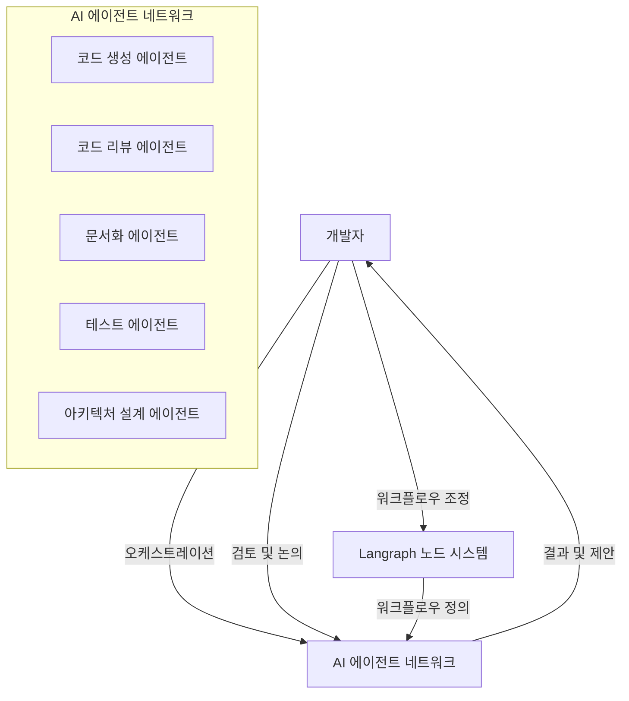
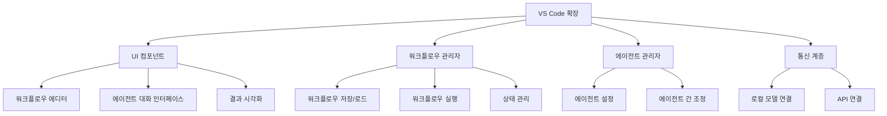

# VS Code AI 오케스트레이션 시스템

## 1. 시스템 개요

VS Code AI 오케스트레이션 시스템은 개발자와 다수의 AI 에이전트가 유기적으로 협업하는 새로운 개발 환경을 제공합니다. 이 시스템은 단순한 AI 코딩 도우미를 넘어, 개발자가 여러 AI 에이전트의 작업 흐름을 조율하고 함께 논의하며 개발을 진행할 수 있는 플랫폼입니다.



## 2. 핵심 기능

### 2.1 다중 AI 에이전트 협업

이 시스템의 핵심은 서로 다른 역할과 전문성을 가진 여러 AI 에이전트가 함께 작업하는 구조입니다:

- **코드 생성 에이전트**: 요구사항에 따른 코드 작성
- **코드 리뷰 에이전트**: 생성된 코드 검토 및 개선 제안
- **문서화 에이전트**: 코드 및 API 문서 자동 생성
- **테스트 에이전트**: 테스트 케이스 생성 및 실행
- **아키텍처 설계 에이전트**: 시스템 구조 설계 및 제안

각 에이전트는 독립적으로 작동하면서도 서로 협업하여 복잡한 개발 작업을 수행합니다.

### 2.2 개발자의 이중 역할

개발자는 이 시스템에서 두 가지 핵심 역할을 담당합니다:

1. **오케스트레이터**: AI 에이전트들의 작업 흐름을 정의하고 조정
   - 워크플로우 구성 요소 선택 및 배치
   - 에이전트 간 데이터 흐름 정의
   - 상황에 따른 프로세스 동적 조정

2. **검토자 및 논의 참여자**: AI 에이전트와 함께 결과를 검토하고 의사결정
   - 중간 결과물 검토 및 피드백 제공
   - 의사결정 포인트에서 방향 제시
   - AI 에이전트와 양방향 논의 진행

이러한 이중 역할을 통해 개발자는 AI의 능력을 최대한 활용하면서도 개발 과정의 통제권을 유지할 수 있습니다.

### 2.3 Langraph 기반 유연한 워크플로우

[Langraph](https://github.com/langchain-ai/langraph)를 활용하여 노드 기반의 유연한 워크플로우를 구성합니다:

```python
# Langraph 워크플로우 예시 (백엔드 구현 코드)
from langraph.graph import Graph
from langraph.prelude import StateGraph

# 워크플로우 정의
workflow = StateGraph()

# 노드 추가
workflow.add_node("requirement_analysis", fn=requirement_analysis_agent)
workflow.add_node("code_generation", fn=code_generation_agent)
workflow.add_node("human_review", fn=human_review_interface)  # 개발자 개입 노드
workflow.add_node("code_testing", fn=test_generation_agent)
workflow.add_node("documentation", fn=documentation_agent)

# 엣지 연결
workflow.add_edge("requirement_analysis", "code_generation")
workflow.add_edge("code_generation", "human_review")
workflow.add_edge("human_review", "code_testing")
workflow.add_edge("code_testing", "documentation")

# 조건부 엣지 (개발자 결정에 따라 다른 경로로 분기)
workflow.add_conditional_edges(
    "human_review",
    lambda state: state["review_result"],
    {
        "approve": "code_testing",
        "revise": "code_generation",
        "redesign": "requirement_analysis"
    }
)

# 컴파일 및 실행
app = workflow.compile()
```

이 노드 기반 시스템의 장점:
- 워크플로우를 시각적으로 구성 및 편집 가능
- 개발 과정에서 필요에 따라 노드 추가/제거/변경 가능
- 특정 단계에 개발자 개입 노드 삽입 가능
- 에이전트 역할과 책임을 명확하게 정의 가능

## 3. 주요 구현 기술

### 3.1 VS Code 확장 아키텍처

VS Code 확장은 다음과 같은 구조로 구현됩니다:



### 3.2 다중 Ollama 지원

Ollama를 통해 100% 로컬 개발 환경을 구축할 수 있습니다:

```typescript
// ai/agents/agentManager.ts
import { OllamaModel } from '../models/ollamaModel';

export interface AgentConfig {
    name: string;
    role: string;
    modelConfig: {
        type: 'ollama' | 'openai' | 'claude' | 'clova';
        modelName: string;
        parameters: Record<string, any>;
    };
    systemPrompt: string;
}

export class AgentManager {
    private agents: Map<string, Agent> = new Map();
    
    async createAgent(config: AgentConfig): Promise<Agent> {
        let model;
        
        // 모델 타입에 따라 적절한 모델 인스턴스 생성
        switch (config.modelConfig.type) {
            case 'ollama':
                model = new OllamaModel({
                    endpoint: 'http://localhost:11434',
                    modelName: config.modelConfig.modelName,
                    contextSize: 8192
                });
                break;
            // 다른 모델 타입 처리...
        }
        
        // 에이전트 생성
        const agent = new Agent(
            config.name,
            config.role,
            model,
            config.systemPrompt
        );
        
        this.agents.set(config.name, agent);
        return agent;
    }
    
    getAgent(name: string): Agent | undefined {
        return this.agents.get(name);
    }
    
    // 기타 에이전트 관리 메서드...
}
```

### 3.3 워크플로우 에디터 UI

개발자가 쉽게 워크플로우를 조정할 수 있는 직관적인 UI를 제공합니다:

```typescript
// ui/workflowEditor.ts
import * as vscode from 'vscode';
import { WorkflowManager } from '../workflow/workflowManager';

export class WorkflowEditorPanel {
    public static currentPanel: WorkflowEditorPanel | undefined;
    private readonly _panel: vscode.WebviewPanel;
    private readonly _extensionUri: vscode.Uri;
    private _disposables: vscode.Disposable[] = [];
    private _workflowManager: WorkflowManager;
    
    // 워크플로우 에디터 패널 생성 및 초기화
    public static createOrShow(extensionUri: vscode.Uri, workflowManager: WorkflowManager): void {
        // 구현 생략...
    }
    
    // 메시지 처리
    private _handleMessage(message: any): void {
        switch (message.command) {
            case 'addNode':
                this._workflowManager.addNode(message.nodeType, message.position);
                break;
            case 'removeNode':
                this._workflowManager.removeNode(message.nodeId);
                break;
            case 'connectNodes':
                this._workflowManager.connectNodes(message.sourceId, message.targetId);
                break;
            case 'updateNodeConfig':
                this._workflowManager.updateNodeConfig(message.nodeId, message.config);
                break;
            case 'runWorkflow':
                this._workflowManager.runWorkflow();
                break;
            // 기타 명령 처리...
        }
    }
    
    // 워크플로우 시각화 UI 업데이트
    private _updateWebview(): void {
        // 구현 생략...
    }
}
```

다음 문서에서는 CLOVA X API 통합, AI 에이전트의 메타인지 기능, RAG 시스템 등에 대해 자세히 설명하겠습니다. 