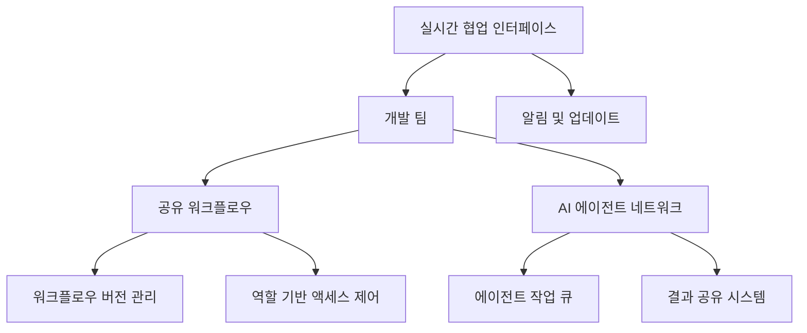
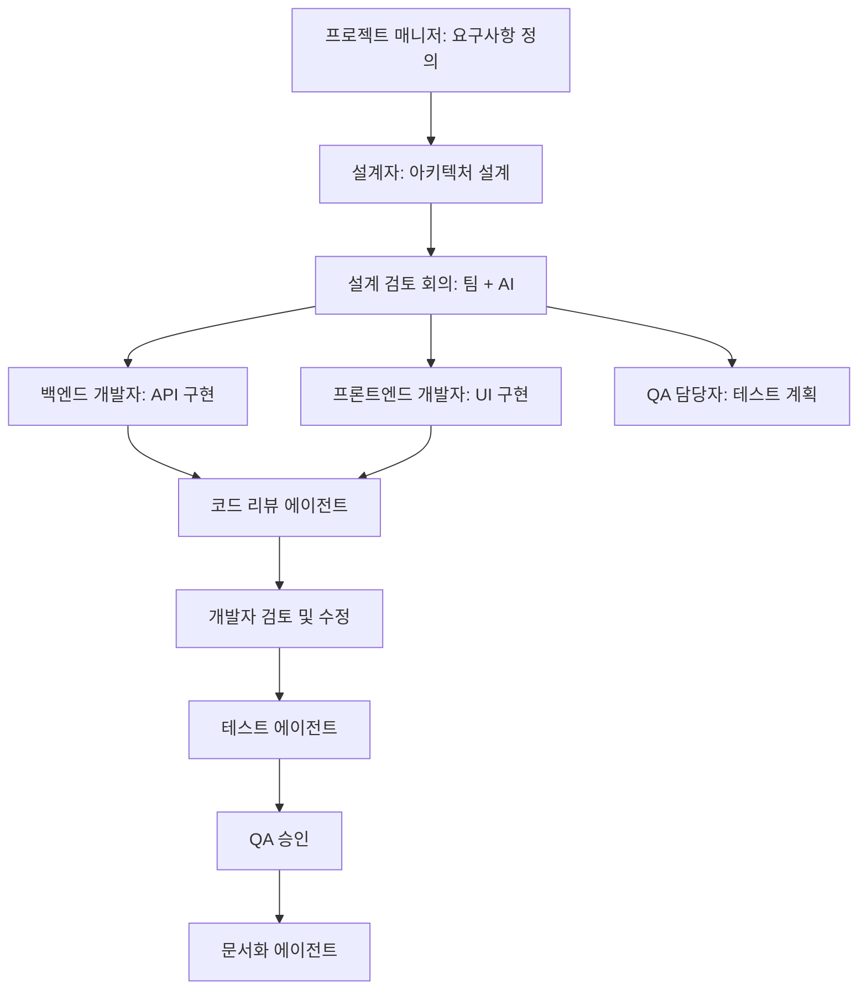
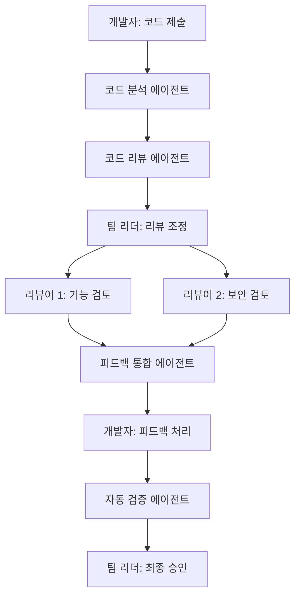

# VS Code AI 오케스트레이션 시스템: 팀 협업 기능

> **중요 참고사항**: 이 문서는 개념적 참조 구현을 제시하는 설계 가이드입니다. 제공된 코드 예시는 실제 작동하는 코드가 아니며, VS Code API 및 현존하는 협업 도구를 활용한 실현 가능한 접근 방식을 보여주기 위한 것입니다.

## 1. 팀 기반 AI 오케스트레이션 개요

VS Code AI 오케스트레이션 시스템은 개인 개발자뿐만 아니라 팀 단위의 협업을 지원합니다. 여러 개발자가 AI 에이전트와 함께 작업하며 역할을 분담하고 결과를 공유할 수 있습니다.



### 1.1 현실적인 구현 방향

팀 협업 기능을 구현할 때 다음과 같은 기존 VS Code 기능과 확장을 활용하는 것이 실용적입니다:

1. **VS Code Live Share 통합**: Microsoft의 공식 실시간 협업 확장을 활용하여 워크플로우 편집 공유
2. **GitHub/GitLab 통합**: 기존 버전 관리 시스템을 활용하여 워크플로우 정의 파일 저장 및 공유
3. **VS Code 설정 동기화**: 워크플로우 설정을 VS Code 설정의 일부로 관리하여 기존 동기화 메커니즘 활용

## 2. 공유 워크플로우 시스템

### 2.1 워크플로우 공유 및 동기화

다음은 VS Code 확장에서 구현 가능한 워크플로우 공유 시스템의 개념적 구현입니다:

```typescript
// 워크플로우 정의 인터페이스 (참조용)
export interface WorkflowDefinition {
    id: string;
    name: string;
    description?: string;
    nodes: WorkflowNode[];
    edges: WorkflowEdge[];
    metadata: Record<string, any>;
    version: number;
    lastModified: number;
    createdBy: string;
}

// 스토리지 프로바이더 인터페이스 (참조용)
export interface StorageProvider {
    // 워크플로우 관련 메서드
    getWorkflows(): Promise<WorkflowDefinition[]>;
    getWorkflow(id: string): Promise<WorkflowDefinition | undefined>;
    saveWorkflow(workflow: WorkflowDefinition): Promise<void>;
    updateWorkflow(id: string, workflow: WorkflowDefinition): Promise<void>;
    deleteWorkflow(id: string): Promise<void>;
    
    // 팀 협업 관련 메서드
    getTeamAssignments(): Promise<Map<string, string[]>>;
    updateTeamAssignment(workflowId: string, memberIds: string[]): Promise<void>;
    
    // 알림 관련 메서드
    createNotification(userId: string, notification: any): Promise<void>;
    // ... 기타 메서드
}

// workflow/sharedWorkflowManager.ts
import * as vscode from 'vscode';
import { WorkflowDefinition } from './workflowTypes';
import { StorageProvider } from '../storage/storageProvider';

export class SharedWorkflowManager {
    private storageProvider: StorageProvider;
    private activeWorkflows: Map<string, WorkflowDefinition> = new Map();
    private teamMembers: Map<string, string[]> = new Map(); // workflowId -> memberIds
    
    constructor(storageProvider: StorageProvider) {
        this.storageProvider = storageProvider;
    }
    
    async loadSharedWorkflows(): Promise<void> {
        try {
            const workflows = await this.storageProvider.getWorkflows();
            workflows.forEach(workflow => {
                this.activeWorkflows.set(workflow.id, workflow);
            });
            
            const teamAssignments = await this.storageProvider.getTeamAssignments();
            teamAssignments.forEach((members, workflowId) => {
                this.teamMembers.set(workflowId, members);
            });
        } catch (error) {
            console.error('공유 워크플로우 로드 중 오류:', error);
            throw new Error('팀 워크플로우를 로드할 수 없습니다.');
        }
    }
    
    // ... 다른 메서드 생략
}
```

### 2.2 현실적인 구현 옵션

실제 VS Code 확장에서 워크플로우를 공유하는 방법으로 다음과 같은 접근 방식을 고려할 수 있습니다:

1. **파일 기반 공유**:
   - 워크플로우를 JSON 파일로 저장하고 Git 또는 다른 버전 관리 시스템으로 공유
   - VS Code의 기존 SCM(Source Control Management) 통합 활용
   - 장점: 간단한 구현, 기존 개발 워크플로우와 통합 용이
   - 예시 코드:

```typescript
// 파일 기반 워크플로우 저장 예시
export class FileBasedStorageProvider implements StorageProvider {
    private workspacePath: string;
    
    constructor(context: vscode.ExtensionContext) {
        // 워크스페이스 루트 폴더의 .vscode 디렉토리에 저장
        const workspaceFolder = vscode.workspace.workspaceFolders?.[0];
        if (!workspaceFolder) {
            throw new Error('워크스페이스를 열어야 합니다.');
        }
        
        this.workspacePath = path.join(
            workspaceFolder.uri.fsPath,
            '.vscode',
            'ai-workflows'
        );
        
        // 디렉토리 생성 확인
        if (!fs.existsSync(this.workspacePath)) {
            fs.mkdirSync(this.workspacePath, { recursive: true });
        }
    }
    
    async getWorkflows(): Promise<WorkflowDefinition[]> {
        const workflows: WorkflowDefinition[] = [];
        const files = fs.readdirSync(this.workspacePath);
        
        for (const file of files) {
            if (file.endsWith('.workflow.json')) {
                const content = fs.readFileSync(
                    path.join(this.workspacePath, file),
                    'utf-8'
                );
                try {
                    const workflow = JSON.parse(content) as WorkflowDefinition;
                    workflows.push(workflow);
                } catch (error) {
                    console.error(`워크플로우 파일 파싱 오류: ${file}`, error);
                }
            }
        }
        
        return workflows;
    }
    
    // ... 다른 메서드 구현
}
```

2. **VS Code Live Share 세션**:
   - Microsoft의 공식 실시간 협업 확장인 Live Share를 활용
   - 워크플로우 에디터를 Live Share 세션과 통합하여 실시간 편집 지원
   - 장점: 성숙한 협업 플랫폼 활용, 안정적인 실시간 편집 경험
   - 예시 코드:

```typescript
// Live Share 통합 예시 (콘셉트)
import * as vsls from 'vsls';

export class LiveShareIntegration {
    private liveshare: vsls.LiveShare | undefined;
    private workflowService: any; // 워크플로우 서비스
    
    async initialize() {
        try {
            // Live Share API 액세스
            this.liveshare = await vsls.getApi();
            
            if (this.liveshare) {
                // 세션 이벤트 리스닝
                this.liveshare.onDidChangeSession(
                    this.handleSessionChange.bind(this)
                );
                
                // 공유 서비스 등록
                if (this.liveshare.session.role === vsls.Role.Host) {
                    await this.registerSharedServices();
                } else if (this.liveshare.session.role === vsls.Role.Guest) {
                    await this.connectToSharedServices();
                }
            }
        } catch (error) {
            console.error('Live Share 초기화 오류:', error);
        }
    }
    
    // ... 다른 메서드 구현
}
```

## 3. 역할 기반 액세스 제어

VS Code 확장에서 역할 기반 액세스 제어를 구현하는 것은 도전적일 수 있습니다. 더 현실적인 접근 방식은 기존 Git 권한 모델이나 클라우드 서비스를 활용하는 것입니다:

### 3.1 Git 기반 권한 모델

워크플로우 정의를 Git 저장소에 저장하고 Git의 권한 모델을 활용할 수 있습니다:

```typescript
// GitBasedPermissionManager.ts (개념적 참조)
export class GitBasedPermissionManager {
    // Git 저장소 권한을 활용하여 워크플로우 접근 제어
    async checkPermission(workflowId: string, userId: string, requiredRole: string): Promise<boolean> {
        // 1. 워크플로우 파일의 저장소 경로 확인
        // 2. Git 권한 확인 (예: GitHub API 사용)
        // 3. 워크플로우 관련 저장소 권한 매핑
        
        // 예시: GitHub 저장소 권한 확인
        const repoPermission = await this.getGitHubRepoPermission(userId);
        
        // 권한 수준에 따라 응답
        switch (requiredRole) {
            case 'viewer':
                return repoPermission === 'read' || repoPermission === 'write' || repoPermission === 'admin';
            case 'editor':
                return repoPermission === 'write' || repoPermission === 'admin';
            case 'manager':
            case 'owner':
                return repoPermission === 'admin';
            default:
                return false;
        }
    }
    
    // ... 다른 메서드 구현
}
```

### 3.2 클라우드 서비스 권한 통합

VS Code 확장에서 클라우드 서비스의 기존 인증 및 권한 모델을 활용하는 방법:

```typescript
// 예시: Azure DevOps 또는 GitHub 통합
export class CloudPermissionManager {
    async initialize(provider: 'github' | 'azure-devops'): Promise<void> {
        // 선택한 클라우드 서비스에 따라 인증 및 권한 관리 초기화
    }
    
    async getCurrentUserRoles(): Promise<Map<string, string>> {
        // 현재 사용자의 프로젝트/저장소 역할 가져오기
        return new Map(); // 워크플로우 ID -> 역할 매핑
    }
    
    // ... 다른 메서드 구현
}
```

## 4. 실시간 협업 인터페이스

### 4.1 VS Code Live Share 기반 협업

VS Code에서 실시간 협업을 구현하기 위한 가장 실용적인 접근 방식은 Live Share를 활용하는 것입니다:

```typescript
// LiveShareWorkflowCollaboration.ts
import * as vscode from 'vscode';
import * as vsls from 'vsls';

export class LiveShareWorkflowCollaboration {
    private liveshare: vsls.LiveShare | undefined;
    private sharedService: vsls.SharedService | undefined;
    
    constructor(private extensionContext: vscode.ExtensionContext) {}
    
    async initialize(): Promise<void> {
        try {
            this.liveshare = await vsls.getApi();
            
            if (!this.liveshare) {
                throw new Error('Live Share 확장이 설치되지 않았습니다.');
            }
            
            // 세션 변경 이벤트 구독
            this.liveshare.onDidChangeSession(async e => {
                if (e.session.role === vsls.Role.Host) {
                    await this.registerCollaborationService();
                } else if (e.session.role === vsls.Role.Guest) {
                    await this.joinCollaborationService();
                }
            });
            
            // 이미 세션이 활성화된 경우 초기화
            if (this.liveshare.session) {
                if (this.liveshare.session.role === vsls.Role.Host) {
                    await this.registerCollaborationService();
                } else if (this.liveshare.session.role === vsls.Role.Guest) {
                    await this.joinCollaborationService();
                }
            }
        } catch (error) {
            console.error('Live Share 초기화 오류:', error);
            vscode.window.showErrorMessage('Live Share 초기화 중 오류가 발생했습니다.');
        }
    }
    
    private async registerCollaborationService(): Promise<void> {
        if (!this.liveshare) return;
        
        // 공유 서비스 등록
        this.sharedService = await this.liveshare.shareService('ai-workflow-collaboration');
        
        if (this.sharedService) {
            // 요청 처리기 등록
            this.sharedService.onRequest('updateWorkflow', (args) => {
                // 워크플로우 업데이트 처리
                return this.handleWorkflowUpdate(args);
            });
            
            // 알림 처리기 등록
            this.sharedService.onNotify('cursorMove', (args) => {
                // 커서 이동 처리
                this.handleCursorMove(args);
            });
        }
    }
    
    private async joinCollaborationService(): Promise<void> {
        if (!this.liveshare) return;
        
        // 공유 서비스 접근
        this.sharedService = await this.liveshare.getSharedService('ai-workflow-collaboration');
        
        if (this.sharedService) {
            // 초기 상태 요청
            const workflows = await this.sharedService.request('getWorkflows', {});
            // 워크플로우 상태 업데이트
        }
    }
    
    // ... 다른 메서드 구현
}
```

### 4.2 현실적인 대안: 파일 감시 + 알림

Live Share를 사용할 수 없는 경우, 파일 시스템 감시와 알림 메커니즘을 통한 협업 방식:

```typescript
// FileWatchingCollaboration.ts
import * as vscode from 'vscode';
import * as fs from 'fs';
import * as path from 'path';

export class FileWatchingCollaboration {
    private fileWatcher: vscode.FileSystemWatcher | undefined;
    private workflowsPath: string;
    
    constructor(context: vscode.ExtensionContext) {
        const workspaceFolder = vscode.workspace.workspaceFolders?.[0];
        if (!workspaceFolder) {
            throw new Error('워크스페이스가 필요합니다.');
        }
        
        this.workflowsPath = path.join(
            workspaceFolder.uri.fsPath,
            '.vscode',
            'ai-workflows'
        );
    }
    
    initialize(): void {
        // 워크플로우 파일 감시
        this.fileWatcher = vscode.workspace.createFileSystemWatcher(
            new vscode.RelativePattern(this.workflowsPath, '*.workflow.json')
        );
        
        // 파일 변경 이벤트 처리
        this.fileWatcher.onDidChange(this.handleFileChange.bind(this));
        this.fileWatcher.onDidCreate(this.handleFileCreation.bind(this));
        this.fileWatcher.onDidDelete(this.handleFileDeletion.bind(this));
    }
    
    private async handleFileChange(uri: vscode.Uri): Promise<void> {
        try {
            // 파일 내용 읽기
            const content = fs.readFileSync(uri.fsPath, 'utf-8');
            const workflow = JSON.parse(content);
            
            // 알림 표시
            vscode.window.showInformationMessage(
                `"${workflow.name}" 워크플로우가 업데이트되었습니다.`
            );
            
            // UI 업데이트
            // ...
        } catch (error) {
            console.error('워크플로우 파일 처리 오류:', error);
        }
    }
    
    // ... 다른 메서드 구현
}
```

## 5. 팀 알림 시스템

### 5.1 VS Code 알림 채널 활용

VS Code의 내장 알림 메커니즘을 활용한 팀 협업 알림 시스템:

```typescript
// NotificationManager.ts
import * as vscode from 'vscode';

export class NotificationManager {
    private channel: vscode.OutputChannel;
    
    constructor(context: vscode.ExtensionContext) {
        // 알림 채널 생성
        this.channel = vscode.window.createOutputChannel('AI Workflow 알림');
        
        // 정기적으로 알림 확인
        const interval = setInterval(() => this.checkNotifications(), 60000);
        context.subscriptions.push({ dispose: () => clearInterval(interval) });
    }
    
    private async checkNotifications(): Promise<void> {
        try {
            // 알림 데이터 가져오기 (예: Git 커밋, 이슈, PR 등)
            const notifications = await this.fetchNotifications();
            
            if (notifications.length === 0) return;
            
            // 알림 채널에 메시지 추가
            this.channel.appendLine('--- 새 알림 ---');
            for (const notification of notifications) {
                this.channel.appendLine(
                    `[${new Date(notification.timestamp).toLocaleTimeString()}] ${notification.message}`
                );
            }
            
            // 새 알림이 있음을 알림
            vscode.window.showInformationMessage(
                `${notifications.length}개의 새 워크플로우 알림이 있습니다.`,
                '알림 보기'
            ).then(selection => {
                if (selection === '알림 보기') {
                    this.channel.show();
                }
            });
        } catch (error) {
            console.error('알림 확인 중 오류:', error);
        }
    }
    
    // ... 다른 메서드 구현
}
```

### 5.2 외부 알림 연동

Slack, Microsoft Teams 등의 외부 알림 시스템과 연동하는 방법:

```typescript
// ExternalNotifications.ts (개념적 참조)
export class ExternalNotificationManager {
    async sendSlackNotification(
        channelId: string,
        message: string,
        metadata?: any
    ): Promise<void> {
        try {
            // Slack API를 통해 알림 전송
            // 실제 구현에서는 webpack 설정으로 node-fetch 또는 axios 사용
            const response = await fetch('https://slack.com/api/chat.postMessage', {
                method: 'POST',
                headers: {
                    'Content-Type': 'application/json',
                    'Authorization': `Bearer ${process.env.SLACK_TOKEN}`
                },
                body: JSON.stringify({
                    channel: channelId,
                    text: message,
                    // 추가 옵션...
                })
            });
            
            // 응답 처리
            // ...
        } catch (error) {
            console.error('Slack 알림 전송 오류:', error);
        }
    }
    
    // Microsoft Teams, 이메일 등 다른 통합 메서드...
}
```

## 6. 워크플로우 에디터 UI

### 6.1 웹뷰 기반 에디터

VS Code의 웹뷰를 사용한 워크플로우 에디터 구현:

```typescript
// WorkflowEditorPanel.ts
import * as vscode from 'vscode';
import * as path from 'path';

export class WorkflowEditorPanel {
    public static currentPanel: WorkflowEditorPanel | undefined;
    private readonly _panel: vscode.WebviewPanel;
    private readonly _extensionUri: vscode.Uri;
    private _disposables: vscode.Disposable[] = [];
    
    private static readonly viewType = 'aiWorkflowEditor';
    
    private constructor(panel: vscode.WebviewPanel, extensionUri: vscode.Uri) {
        this._panel = panel;
        this._extensionUri = extensionUri;
        
        // 웹뷰 콘텐츠 설정
        this._panel.webview.html = this._getWebviewContent();
        
        // 웹뷰 이벤트 처리
        this._panel.onDidDispose(() => this.dispose(), null, this._disposables);
        this._panel.webview.onDidReceiveMessage(this._handleMessage.bind(this), null, this._disposables);
    }
    
    public static createOrShow(extensionUri: vscode.Uri): WorkflowEditorPanel {
        const column = vscode.window.activeTextEditor
            ? vscode.window.activeTextEditor.viewColumn
            : undefined;
        
        // 이미 패널이 있는 경우 재사용
        if (WorkflowEditorPanel.currentPanel) {
            WorkflowEditorPanel.currentPanel._panel.reveal(column);
            return WorkflowEditorPanel.currentPanel;
        }
        
        // 새 패널 생성
        const panel = vscode.window.createWebviewPanel(
            WorkflowEditorPanel.viewType,
            'AI 워크플로우 에디터',
            column || vscode.ViewColumn.One,
            {
                enableScripts: true,
                localResourceRoots: [
                    vscode.Uri.joinPath(extensionUri, 'media'),
                    vscode.Uri.joinPath(extensionUri, 'dist')
                ]
            }
        );
        
        WorkflowEditorPanel.currentPanel = new WorkflowEditorPanel(panel, extensionUri);
        return WorkflowEditorPanel.currentPanel;
    }
    
    private _getWebviewContent(): string {
        // 웹뷰에 표시할 HTML 생성
        // 실제 구현에서는 더 복잡한 UI와 에디터 프레임워크 사용
        return `<!DOCTYPE html>
            <html lang="ko">
            <head>
                <meta charset="UTF-8">
                <meta name="viewport" content="width=device-width, initial-scale=1.0">
                <title>AI 워크플로우 에디터</title>
                <style>
                    body { font-family: Arial, sans-serif; margin: 0; padding: 0; }
                    .container { padding: 20px; }
                    /* 에디터 스타일 */
                </style>
            </head>
            <body>
                <div class="container">
                    <h1>AI 워크플로우 에디터</h1>
                    <div id="editor"></div>
                    <div id="controls">
                        <button id="btn-save">저장</button>
                        <button id="btn-share">공유</button>
                    </div>
                </div>
                <script>
                    // 에디터 초기화 및 이벤트 처리
                    const vscode = acquireVsCodeApi();
                    
                    // 메시지 처리
                    window.addEventListener('message', event => {
                        const message = event.data;
                        // 메시지 처리 로직...
                    });
                    
                    // UI 이벤트 처리
                    document.getElementById('btn-save').addEventListener('click', () => {
                        // 워크플로우 저장 요청
                        vscode.postMessage({
                            command: 'save',
                            workflow: { /* 워크플로우 데이터 */ }
                        });
                    });
                    
                    document.getElementById('btn-share').addEventListener('click', () => {
                        // 공유 대화상자 표시 요청
                        vscode.postMessage({
                            command: 'showShareDialog'
                        });
                    });
                </script>
            </body>
            </html>`;
    }
    
    private _handleMessage(message: any): void {
        switch (message.command) {
            case 'save':
                // 워크플로우 저장 처리
                this._saveWorkflow(message.workflow);
                break;
            case 'showShareDialog':
                // 공유 대화상자 표시
                this._showShareDialog();
                break;
            // 기타 메시지 처리...
        }
    }
    
    // ... 다른 메서드 구현
    
    private dispose(): void {
        WorkflowEditorPanel.currentPanel = undefined;
        
        // 자원 해제
        this._panel.dispose();
        while (this._disposables.length) {
            const disposable = this._disposables.pop();
            if (disposable) {
                disposable.dispose();
            }
        }
    }
}
```

## 7. 팀 기반 오케스트레이션 워크플로우 예시

### 7.1 협업적 기능 개발 워크플로우



### 7.2 코드 리뷰 워크플로우



## 8. 결론 및 실제 적용 방안

VS Code AI 오케스트레이션 시스템의 팀 협업 기능은 다음과 같은 단계적 접근 방식으로 구현할 수 있습니다:

1. **1단계: 파일 기반 공유**
   - 워크플로우를 Git 저장소에 저장하고 팀원과 공유
   - Git의 기존 브랜치, PR 프로세스를 활용한 협업
   - VS Code의 Source Control 확장 활용

2. **2단계: 웹뷰 에디터 + Live Share**
   - 커스텀 워크플로우 에디터 구현
   - Live Share API 통합으로 실시간 협업 구현
   - 웹뷰 UI에서 실시간 커서 및 변경 사항 표시

3. **3단계: 클라우드 서비스 통합**
   - GitHub/Azure 등의 클라우드 서비스와 통합
   - 중앙 집중식 워크플로우 저장소 및 권한 관리
   - 알림 시스템 및 이벤트 로깅

이러한 접근 방식을 통해 현실적인 제약 내에서 점진적으로 협업 기능을 구축하고 확장할 수 있습니다.

## 9. 참고 자료

- [VS Code Extension API 문서](https://code.visualstudio.com/api)
- [VS Code Live Share API 문서](https://docs.microsoft.com/en-us/visualstudio/liveshare/reference/api)
- [GitHub REST API 문서](https://docs.github.com/en/rest) 