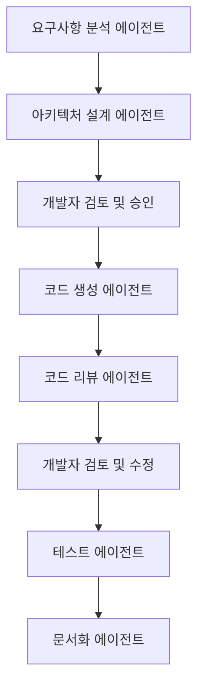
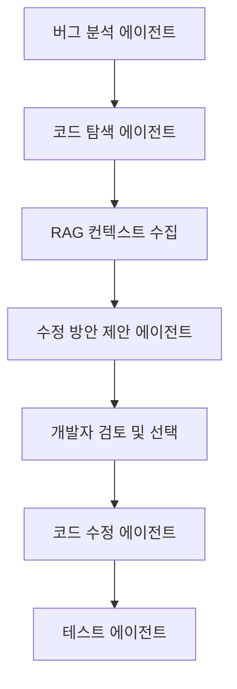
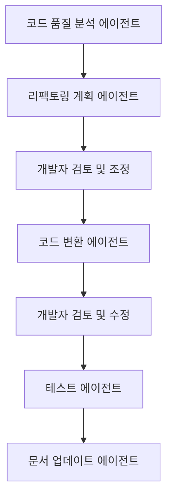

# VS Code AI 오케스트레이션 시스템 (계속)

## 6. RAG 지원 및 로컬 검색 기반 확장

VS Code AI 오케스트레이션 시스템은 코드베이스 이해와 관련 컨텍스트 제공을 위해 RAG(Retrieval-Augmented Generation) 기능을 지원합니다.

### 6.1 로컬 벡터 데이터베이스 구현

프로젝트의 코드 및 문서를 벡터화하고 검색할 수 있는 로컬 벡터 데이터베이스:

```typescript
// ai/rag/vectorDatabase.ts
import * as vscode from 'vscode';
import * as fs from 'fs';
import * as path from 'path';
import { EmbeddingModel } from '../models/embeddingModel';

interface VectorDoc {
    id: string;
    path: string;
    content: string;
    vector: number[];
    metadata: {
        lastModified: number;
        fileType: string;
        size: number;
    };
}

export class VectorDatabase {
    private docs: VectorDoc[] = [];
    private embeddingModel: EmbeddingModel;
    private dbPath: string;
    private indexing: boolean = false;
    
    constructor(workspacePath: string, embeddingModel: EmbeddingModel) {
        this.embeddingModel = embeddingModel;
        this.dbPath = path.join(workspacePath, '.vscode', 'ai-vector-db.json');
    }
    
    async initialize(): Promise<void> {
        // 기존 벡터 DB 로드
        try {
            if (fs.existsSync(this.dbPath)) {
                const data = fs.readFileSync(this.dbPath, 'utf8');
                this.docs = JSON.parse(data);
            }
        } catch (error) {
            console.error('벡터 DB 로드 중 오류:', error);
        }
        
        // 워크스페이스 파일 인덱싱
        await this.indexWorkspace();
    }
    
    async indexWorkspace(): Promise<void> {
        if (this.indexing) return;
        
        this.indexing = true;
        
        try {
            const workspaceFolders = vscode.workspace.workspaceFolders;
            if (!workspaceFolders) return;
            
            for (const folder of workspaceFolders) {
                await this.indexFolder(folder.uri.fsPath);
            }
            
            // 벡터 DB 저장
            this.save();
        } finally {
            this.indexing = false;
        }
    }
    
    private async indexFolder(folderPath: string): Promise<void> {
        const files = fs.readdirSync(folderPath);
        
        for (const file of files) {
            const filePath = path.join(folderPath, file);
            const stat = fs.statSync(filePath);
            
            if (stat.isDirectory()) {
                // node_modules, .git 등은 제외
                if (file !== 'node_modules' && file !== '.git') {
                    await this.indexFolder(filePath);
                }
            } else {
                // 처리할 파일 유형 필터링
                const fileExt = path.extname(file).toLowerCase();
                if (['.ts', '.js', '.tsx', '.jsx', '.md', '.json', '.html', '.css', '.py', '.rs'].includes(fileExt)) {
                    await this.indexFile(filePath);
                }
            }
        }
    }
    
    private async indexFile(filePath: string): Promise<void> {
        const relativePath = vscode.workspace.asRelativePath(filePath);
        const stat = fs.statSync(filePath);
        
        // 이미 인덱싱되었고 수정되지 않은 파일은 스킵
        const existingDoc = this.docs.find(doc => doc.path === relativePath);
        if (existingDoc && existingDoc.metadata.lastModified >= stat.mtimeMs) {
            return;
        }
        
        try {
            // 파일 콘텐츠 읽기
            const content = fs.readFileSync(filePath, 'utf8');
            
            // 대용량 파일은 적절히 청크로 분할
            const chunks = this.splitIntoChunks(content, 2000);
            
            // 기존 문서 제거
            this.docs = this.docs.filter(doc => doc.path !== relativePath);
            
            // 각 청크 인덱싱
            for (let i = 0; i < chunks.length; i++) {
                const chunk = chunks[i];
                const vector = await this.embeddingModel.generateEmbedding(chunk);
                
                this.docs.push({
                    id: `${relativePath}#${i}`,
                    path: relativePath,
                    content: chunk,
                    vector,
                    metadata: {
                        lastModified: stat.mtimeMs,
                        fileType: path.extname(filePath).slice(1),
                        size: stat.size
                    }
                });
            }
        } catch (error) {
            console.error(`파일 인덱싱 중 오류: ${filePath}`, error);
        }
    }
    
    private splitIntoChunks(text: string, chunkSize: number): string[] {
        const chunks: string[] = [];
        let currentChunk = '';
        const lines = text.split('\n');
        
        for (const line of lines) {
            if (currentChunk.length + line.length > chunkSize) {
                chunks.push(currentChunk);
                currentChunk = line;
            } else {
                currentChunk += (currentChunk ? '\n' : '') + line;
            }
        }
        
        if (currentChunk) {
            chunks.push(currentChunk);
        }
        
        return chunks;
    }
    
    async search(query: string, limit: number = 5): Promise<Array<{ content: string; path: string; score: number }>> {
        // 쿼리 벡터 생성
        const queryVector = await this.embeddingModel.generateEmbedding(query);
        
        // 코사인 유사도 계산 및 정렬
        const results = this.docs.map(doc => ({
            content: doc.content,
            path: doc.path,
            score: this.cosineSimilarity(queryVector, doc.vector)
        }))
        .sort((a, b) => b.score - a.score)
        .slice(0, limit);
        
        return results;
    }
    
    private cosineSimilarity(vecA: number[], vecB: number[]): number {
        let dotProduct = 0;
        let normA = 0;
        let normB = 0;
        
        for (let i = 0; i < vecA.length; i++) {
            dotProduct += vecA[i] * vecB[i];
            normA += vecA[i] ** 2;
            normB += vecB[i] ** 2;
        }
        
        return dotProduct / (Math.sqrt(normA) * Math.sqrt(normB));
    }
    
    private save(): void {
        try {
            const dirPath = path.dirname(this.dbPath);
            if (!fs.existsSync(dirPath)) {
                fs.mkdirSync(dirPath, { recursive: true });
            }
            
            fs.writeFileSync(this.dbPath, JSON.stringify(this.docs), 'utf8');
        } catch (error) {
            console.error('벡터 DB 저장 중 오류:', error);
        }
    }
}
```

### 6.2 RAG 기반 에이전트 확장

RAG를 활용하여 에이전트의 코드 이해 및 생성 능력을 향상시키는 기능:

```typescript
// ai/rag/ragAgent.ts
import { Agent } from '../agents/agent';
import { VectorDatabase } from './vectorDatabase';

export class RagEnhancedAgent extends Agent {
    private vectorDb: VectorDatabase;
    
    constructor(name: string, role: string, model: AIModel, systemPrompt: string, vectorDb: VectorDatabase) {
        super(name, role, model, systemPrompt);
        this.vectorDb = vectorDb;
    }
    
    async process(input: string): Promise<string> {
        // 입력과 관련된 컨텍스트 검색
        const relevantDocs = await this.vectorDb.search(input, 3);
        
        // 검색된 문서로 프롬프트 확장
        let enhancedPrompt = `다음은 현재 프로젝트의 관련 코드 및 문서입니다:\n\n`;
        
        for (const doc of relevantDocs) {
            enhancedPrompt += `파일: ${doc.path}\n\`\`\`\n${doc.content}\n\`\`\`\n\n`;
        }
        
        enhancedPrompt += `위 정보를 참고하여 다음 요청에 응답하세요:\n${input}`;
        
        // 확장된 프롬프트로 처리
        return await super.process(enhancedPrompt);
    }
    
    // 파일 생성 또는 수정을 위한 관련 파일 참조
    async suggestRelatedFiles(task: string): Promise<string[]> {
        const relevantDocs = await this.vectorDb.search(task, 5);
        return relevantDocs.map(doc => doc.path);
    }
    
    // 코드 생성 시 유사한 코드 패턴 참조
    async suggestCodePatterns(description: string): Promise<string> {
        const relevantCode = await this.vectorDb.search(description, 3);
        
        let patterns = `프로젝트의 유사한 코드 패턴:\n\n`;
        
        for (const code of relevantCode) {
            patterns += `파일: ${code.path}\n\`\`\`\n${code.content}\n\`\`\`\n\n`;
        }
        
        return patterns;
    }
}
```

### 6.3 로컬 임베딩 모델 지원

로컬에서 동작하는 임베딩 모델 지원:

```typescript
// ai/models/embeddingModel.ts
import { OllamaModel, OllamaModelConfig } from './ollamaModel';
import axios from 'axios';

export interface EmbeddingModelConfig {
    type: 'ollama' | 'openai' | 'custom';
    modelName: string;
    endpoint?: string;
    apiKey?: string;
    dimensions?: number;
}

export interface EmbeddingModel {
    generateEmbedding(text: string): Promise<number[]>;
    getDimensions(): number;
}

export class OllamaEmbeddingModel implements EmbeddingModel {
    private endpoint: string;
    private modelName: string;
    private dimensions: number;
    
    constructor(config: {endpoint: string; modelName: string; dimensions?: number}) {
        this.endpoint = config.endpoint;
        this.modelName = config.modelName;
        this.dimensions = config.dimensions || 384; // 기본 차원
    }
    
    async generateEmbedding(text: string): Promise<number[]> {
        try {
            const response = await axios.post(`${this.endpoint}/api/embeddings`, {
                model: this.modelName,
                prompt: text
            });
            
            return response.data.embedding;
        } catch (error) {
            console.error('임베딩 생성 중 오류:', error);
            throw new Error('로컬 임베딩 모델 호출 중 오류가 발생했습니다.');
        }
    }
    
    getDimensions(): number {
        return this.dimensions;
    }
}

export class EmbeddingModelFactory {
    static createModel(config: EmbeddingModelConfig): EmbeddingModel {
        switch (config.type) {
            case 'ollama':
                return new OllamaEmbeddingModel({
                    endpoint: config.endpoint || 'http://localhost:11434',
                    modelName: config.modelName,
                    dimensions: config.dimensions
                });
            // 다른 임베딩 모델 타입 처리
            default:
                throw new Error(`지원하지 않는 임베딩 모델 타입: ${config.type}`);
        }
    }
}
```

### 6.4 RAG 컨텍스트 도구 UI

개발자가 쉽게 RAG 기능을 활용할 수 있는 UI 컴포넌트:

```typescript
// ui/ragContextPanel.ts
import * as vscode from 'vscode';
import { VectorDatabase } from '../ai/rag/vectorDatabase';

export class RagContextPanel {
    public static currentPanel: RagContextPanel | undefined;
    private readonly _panel: vscode.WebviewPanel;
    private readonly _extensionUri: vscode.Uri;
    private _disposables: vscode.Disposable[] = [];
    private _vectorDb: VectorDatabase;
    
    public static createOrShow(extensionUri: vscode.Uri, vectorDb: VectorDatabase): void {
        // 구현 생략...
    }
    
    private async _searchContext(query: string): Promise<void> {
        const results = await this._vectorDb.search(query, 5);
        
        this._panel.webview.postMessage({
            command: 'showResults',
            results: results.map(r => ({
                path: r.path,
                content: r.content,
                score: r.score.toFixed(4)
            }))
        });
    }
    
    private _handleMessage(message: any): void {
        switch (message.command) {
            case 'search':
                this._searchContext(message.query);
                break;
            case 'openFile':
                this._openFile(message.path, message.content);
                break;
            case 'reindex':
                this._vectorDb.indexWorkspace();
                vscode.window.showInformationMessage('프로젝트 재인덱싱이 시작되었습니다.');
                break;
            // 기타 명령 처리...
        }
    }
    
    private async _openFile(filePath: string, searchText: string): Promise<void> {
        try {
            const document = await vscode.workspace.openTextDocument(filePath);
            const editor = await vscode.window.showTextDocument(document);
            
            // 텍스트 위치 찾기
            const text = document.getText();
            const position = document.positionAt(text.indexOf(searchText));
            
            // 해당 위치로 이동
            editor.selection = new vscode.Selection(position, position);
            editor.revealRange(
                new vscode.Range(position, position),
                vscode.TextEditorRevealType.InCenter
            );
        } catch (error) {
            console.error('파일 열기 중 오류:', error);
            vscode.window.showErrorMessage(`파일을 열 수 없습니다: ${filePath}`);
        }
    }
}
```

## 7. 워크플로우 예시

다양한 개발 시나리오에 맞는 워크플로우 예시:

### 7.1 기능 개발 워크플로우



### 7.2 버그 수정 워크플로우



### 7.3 코드 리팩토링 워크플로우



## 8. 결론

VS Code AI 오케스트레이션 시스템은 개발자와 다양한 AI 에이전트가 유기적으로 협업하는 새로운 패러다임의 개발 환경을 제공합니다. 주요 특징은 다음과 같습니다:

1. **개발자가 중심이 되는 오케스트레이션**
   - 개발자가 AI 에이전트의 역할과 작업 흐름을 정의하고 조정
   - 개발자와 AI의 양방향 논의를 통한 의사결정
   - Langraph 노드 기반 유연한 워크플로우 구성

2. **다중 AI 에이전트 협업**
   - 특화된 역할을 가진 여러 AI 에이전트의 유기적 협업
   - 에이전트 간 상호작용을 통한 복잡한 작업 수행
   - 최적의 작업 분배를 통한 효율성 향상

3. **로컬 개발 지원**
   - Ollama를 통한 100% 로컬 개발 환경 구축
   - 코드 프라이버시 보장
   - 인터넷 연결 없이도 AI 지원 가능

4. **한국어 최적화**
   - CLOVA X API 지원으로 한국어 개발 환경 최적화
   - 한글-영문 코드 전환 기능
   - 한국어 코드 작성 및 리뷰에 최적화된 에이전트

5. **메타인지 기능**
   - AI 에이전트의 자체 규칙 개선 시스템
   - 성능 모니터링 및 피드백 학습
   - 지속적인 품질 향상

6. **RAG 기반 컨텍스트 인식**
   - 로컬 코드베이스의 벡터 데이터베이스화
   - 코드 생성 및 수정 시 관련 컨텍스트 활용
   - 프로젝트 특화 지식 활용

이 시스템은 개발 생산성을 크게 향상시키면서도 개발자가 중요한 결정과 창의적인 작업에 집중할 수 있게 돕습니다. AI는 반복적이고 지루한 작업을 자동화하고, 개발자에게 유용한 제안과 인사이트를 제공하는 동시에, 개발자는 전체 프로세스를 조율하고 방향을 설정하는 역할을 수행합니다.

앞으로는 팀 협업 기능 강화, 더 다양한 AI 모델 지원, 워크플로우 자동 최적화 등을 통해 이 시스템을 지속적으로 발전시켜 나갈 계획입니다. 