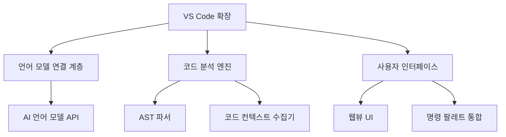

# VS Code AI 코딩 에이전트 구현 가이드 - 파트 1: 아키텍처 및 개요

## 1. 소개

이 가이드는 Cursor AI와 같은 AI 코딩 에이전트를 VS Code 플러그인으로 구현하는 방법을 설명합니다. Cursor AI의 구현 방식에 기반하여 VS Code 확장 프로그램을 통해 강력한 AI 코딩 어시스턴트를 개발하는 과정을 단계별로 안내합니다.

## 2. 아키텍처 개요

AI 코딩 에이전트의 전체 아키텍처는 다음과 같은 주요 요소로 구성됩니다:



### 2.1 주요 컴포넌트

#### 2.1.1 VS Code 확장 핵심

VS Code 확장의 핵심은 `extension.ts` 파일로, 다음과 같은 역할을 담당합니다:

```typescript
import * as vscode from 'vscode';
import { AIModelConnector } from './ai/modelConnector';
import { CodeContextProvider } from './code/contextProvider';
import { CommandRegistry } from './commands/registry';
import { UIProvider } from './ui/provider';

export function activate(context: vscode.ExtensionContext) {
    // AI 모델 커넥터 초기화
    const aiConnector = new AIModelConnector();
    
    // 코드 컨텍스트 제공자 초기화
    const contextProvider = new CodeContextProvider();
    
    // UI 제공자 초기화
    const uiProvider = new UIProvider(context);
    
    // 명령 등록
    const commandRegistry = new CommandRegistry(
        aiConnector, 
        contextProvider,
        uiProvider
    );
    commandRegistry.registerAll(context);
    
    console.log('AI 코딩 에이전트가 활성화되었습니다!');
}

export function deactivate() {
    // 정리 작업 수행
}
```

#### 2.1.2 언어 모델 연결 계층

AI 언어 모델(Claude, GPT 등)과의 통신을 담당합니다:

```typescript
// ai/modelConnector.ts
import axios from 'axios';
import { API_KEY, API_ENDPOINT } from '../config';

export class AIModelConnector {
    private apiKey: string;
    private endpoint: string;
    
    constructor() {
        this.apiKey = API_KEY;
        this.endpoint = API_ENDPOINT;
    }
    
    async generateCompletion(prompt: string, options: any = {}): Promise<string> {
        try {
            const response = await axios.post(this.endpoint, {
                prompt,
                max_tokens: options.maxTokens || 1000,
                temperature: options.temperature || 0.7,
                // 추가 파라미터
            }, {
                headers: {
                    'Authorization': `Bearer ${this.apiKey}`,
                    'Content-Type': 'application/json'
                }
            });
            
            return response.data.choices[0].text;
        } catch (error) {
            console.error('AI 모델 API 호출 중 오류 발생:', error);
            throw error;
        }
    }
}
```

#### 2.1.3 코드 분석 엔진

코드 컨텍스트 수집 및 분석을 담당합니다:

```typescript
// code/contextProvider.ts
import * as vscode from 'vscode';
import * as parser from '@babel/parser';
import * as fs from 'fs';
import * as path from 'path';

export class CodeContextProvider {
    async getCurrentFileContext(): Promise<string> {
        const editor = vscode.window.activeTextEditor;
        if (!editor) {
            return '';
        }
        
        const document = editor.document;
        return document.getText();
    }
    
    async getProjectStructure(depth: number = 2): Promise<string> {
        const workspaceFolders = vscode.workspace.workspaceFolders;
        if (!workspaceFolders) {
            return '';
        }
        
        const rootPath = workspaceFolders[0].uri.fsPath;
        return this.buildDirectoryTree(rootPath, depth);
    }
    
    private buildDirectoryTree(dirPath: string, depth: number, currentDepth: number = 0): string {
        if (currentDepth >= depth) {
            return '';
        }
        
        try {
            const result: string[] = [];
            const files = fs.readdirSync(dirPath);
            
            for (const file of files) {
                // node_modules 및 기타 제외할 디렉토리 건너뛰기
                if (file === 'node_modules' || file === '.git') {
                    continue;
                }
                
                const filePath = path.join(dirPath, file);
                const stats = fs.statSync(filePath);
                
                const indent = '  '.repeat(currentDepth);
                
                if (stats.isDirectory()) {
                    result.push(`${indent}📁 ${file}/`);
                    result.push(this.buildDirectoryTree(filePath, depth, currentDepth + 1));
                } else {
                    result.push(`${indent}📄 ${file}`);
                }
            }
            
            return result.join('\n');
        } catch (error) {
            console.error(`디렉토리 트리 구축 중 오류 발생: ${error}`);
            return '';
        }
    }
    
    async parseCodeAST(code: string): Promise<any> {
        try {
            return parser.parse(code, {
                sourceType: 'module',
                plugins: ['typescript', 'jsx']
            });
        } catch (error) {
            console.error('AST 파싱 중 오류 발생:', error);
            return null;
        }
    }
}
```

## 3. 핵심 작동 원리

Cursor AI 스타일의 코딩 에이전트는 다음과 같은 핵심 원리로 작동합니다:

### 3.1 컨텍스트 수집

AI가 정확한 제안을 하려면 최대한 많은 컨텍스트를 제공해야 합니다:

1. **현재 파일 내용**: 편집 중인 파일의 전체 코드
2. **커서 위치**: 사용자가 코드를 작성/편집하고 있는 위치
3. **프로젝트 구조**: 관련 파일 및 디렉토리 구조
4. **사용자 설정**: 코딩 스타일 및 선호도

### 3.2 프롬프트 엔지니어링

효과적인 AI 응답을 위한 프롬프트 구조:

```typescript
async function generatePrompt(context: CodeContext): Promise<string> {
    return `
당신은 VS Code에서 동작하는 AI 코딩 어시스턴트입니다.
다음 코드와 컨텍스트를 기반으로 사용자 질문에 답하거나 코드를 생성해주세요.

## 현재 파일
\`\`\`${context.language}
${context.currentFileContent}
\`\`\`

## 커서 위치
${context.cursorPosition.line}:${context.cursorPosition.character}

## 프로젝트 구조
${context.projectStructure}

## 사용자 요청
${context.userQuery}

답변은 마크다운 형식으로 제공해주세요. 코드 스니펫이 포함된 경우 적절한 언어 구문 강조를 사용하세요.
`;
}
```

### 3.3 응답 처리

AI로부터 받은 응답을 VS Code 환경에 통합:

```typescript
async function handleAIResponse(response: string): Promise<void> {
    const editor = vscode.window.activeTextEditor;
    if (!editor) {
        vscode.window.showErrorMessage('열린 편집기가 없습니다.');
        return;
    }
    
    // 코드 블록 추출
    const codeBlocks = extractCodeBlocks(response);
    
    if (codeBlocks.length > 0) {
        // 코드 삽입 기능 제공
        const action = await vscode.window.showInformationMessage(
            '코드 삽입?', 
            '전체 삽입', 
            '선택하여 삽입', 
            '무시'
        );
        
        if (action === '전체 삽입') {
            const position = editor.selection.active;
            editor.edit(editBuilder => {
                editBuilder.insert(position, codeBlocks[0].code);
            });
        } else if (action === '선택하여 삽입') {
            // 코드 블록 선택 UI 표시
            // ...
        }
    }
    
    // 전체 응답 표시
    const panel = vscode.window.createWebviewPanel(
        'aiResponse',
        'AI 응답',
        vscode.ViewColumn.Beside,
        { enableScripts: true }
    );
    
    panel.webview.html = renderMarkdown(response);
}

function extractCodeBlocks(markdown: string): Array<{language: string, code: string}> {
    const regex = /```([\w-]*)\n([\s\S]*?)```/g;
    const matches = [];
    let match;
    
    while ((match = regex.exec(markdown)) !== null) {
        matches.push({
            language: match[1],
            code: match[2]
        });
    }
    
    return matches;
}
```

## 4. VS Code API 활용

VS Code API의 핵심 요소:

### 4.1 확장 활성화

```typescript
import * as vscode from 'vscode';

export function activate(context: vscode.ExtensionContext) {
    // 확장 활성화 시 실행될 코드
    const disposable = vscode.commands.registerCommand('aicodingagent.startChat', () => {
        // 명령 실행 시 코드
    });
    
    context.subscriptions.push(disposable);
}
```

### 4.2 설정 액세스

```typescript
function getConfiguration(): any {
    return vscode.workspace.getConfiguration('aiCodingAgent');
}

// 설정 사용 예
const apiKey = getConfiguration().get('apiKey') as string;
const modelName = getConfiguration().get('modelName') as string;
```

## 5. 다음 파트 소개

다음 파트에서는 VS Code 확장 API를 사용하여 AI 코딩 에이전트의 사용자 인터페이스와 상호작용을 구현하는 방법을 다룹니다. 주요 내용은 다음과 같습니다:

- 웹뷰 UI 구현
- 코드 렌즈 및 인라인 제안
- 명령 팔레트 통합
- 키보드 단축키 지원 